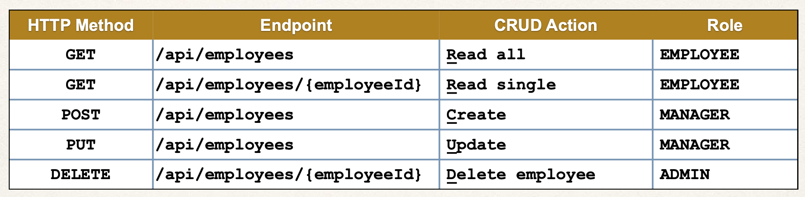
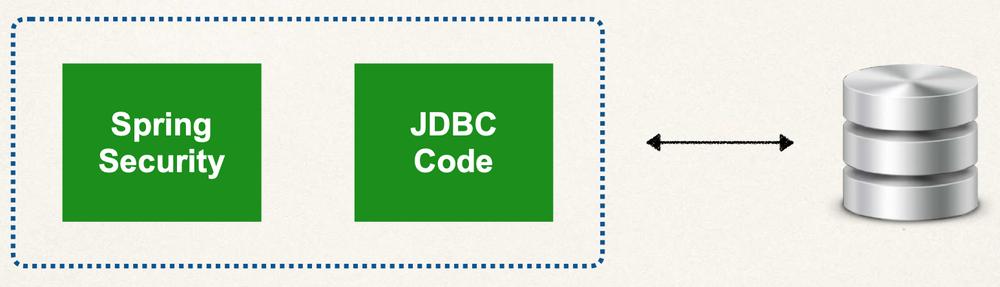
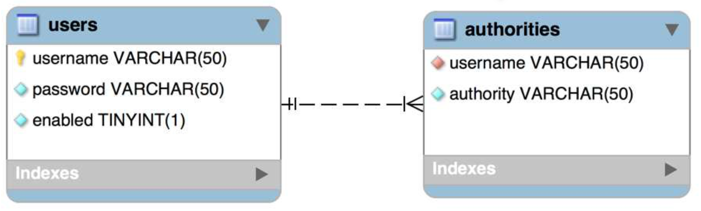
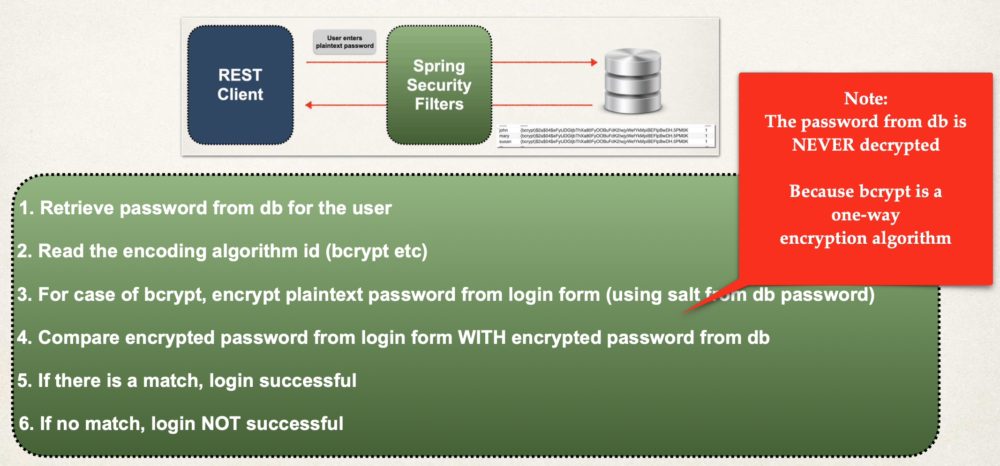
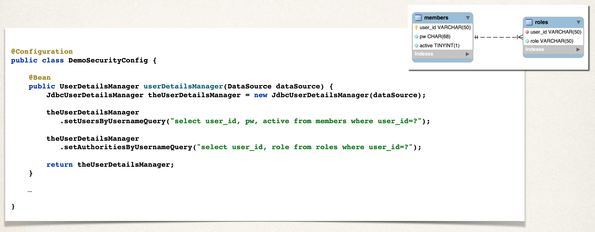

# 05-spring-boot-rest-api-security

`https://docs.spring.io/spring-security/reference/`

Veremos:

- Securizar Spring Boot REST APIs
- Definir usuarios y roles
- Proteger URLs basados en roles
- Almacenar usuarios, password y roles en BD (texto plano -> encriptado)

Spring Security Model

- Spring Security define un framework para seguridad
- Implementado usando Servlet Filters en segundo plano
- Hay dos métodos de securizar una app: declarativa y programática

Spring Security con Servlet Filters

- Servlet Filters se usan para preprocesar / postprocesar peticiones web
- Servlet Filters pueden enrutar peticiones web basadao en lógica de seguridad
- Spring provee una gran cantidad de funciones de seguridad con servlet filters

Visión Spring Security

```
Web       ---->  Spring Security  ---->   Recurso Web
Browser   <----     Filters       <----   Protegido (/mytopsecretstuff)
                       |
                       |-> configuración          usuarios
                           seguridad my app --->  passwords
                                                  roles
```


Conceptos de Seguridad

- Autenticación: comprobar id de usuario y password contra las credenciales almacenadas en app / db
- Autorización: comprobar si un usuario tiene un rol autorizado

Seguridad Declarativa

- Definir restricciones de seguridad de la app en la configuración
  - @Configuration
- Provee separación de cometidos entre el código de la app y seguridad

Seguridad Programática

- Spring Security provee una API para personalizar la codificación de la seguridad
- Provee una gran personalización para requerimientos específicos de la app

Habilitar Spring Security

- Editar pom.xml y añadir spring-boot-starter-security
- Con esto, automáticamente se securizan todos los endpoints de la app

Endpoints Securizados

- Cuando accedamos a nuestra app, Spring Security pedirá un login
- El usuario por defecto será user y el password se genera automáticamente al arrancar la app (en la consola)
- Esto es para testing. Todo esto se puede personalizar en el fichero application.properties
  - spring.security.user.name=jmmunoz
  - spring.security.user.password=my_password

Autenticación y Autorización

Usuarios, passwords y roles se pueden configurar en:

- Memoria
- JDBC
- LDAP
- Personalizado / Enchufable

En esta sección se va a cubrir el password almacenado en BD como texto plano y encriptado.

## 00-spring-boot-rest-security-employee-starter-code

Para el proyecto se usa MariaDB y uso esta imagen Docker:

```
  docker container run \
  -e MARIADB_USER=springstudent \
  -e MARIADB_PASSWORD=springstudent \
  -e MARIADB_ROOT_PASSWORD=springstudentroot \
  -e MARIADB_DATABASE=student_tracker \
  -dp 3306:3306 \
  --name student_tracker \
  --volume student_tracker:/var/lib/mysql \
  mariadb:jammy
```

Y para gestionar la BBDD uso el programa SQuirreL.

Ejecutar las consultas del archivo `employee-directory.sql` para crear una nueva tabla de BBDD llamada employee y poblarla de datos de prueba.

El archivo se encuentra en el directorio `spring-boot-employee-sql-script`

Añadimos la dependencia al POM

```
		<dependency>
			<groupId>org.springframework.boot</groupId>
			<artifactId>spring-boot-starter-security</artifactId>
		</dependency>
```

Y para testear vamos a la ruta `http://localhost:8080/api/employees`

Sin modificar application.properties. Nos saldrá una página de login donde el usuario es user y el password aparece en la consola al ejecutar la app.

Modificando application.properties podemos indicar el usuario y el password que queramos.

### Configuración Básica

- Vamos a crear 3 usuarios con sus roles
- Vamos a crear una Configuración de Spring Security (con la anotación @Configuration)
- Añadimos esos usuarios, password y sus roles

En Spring Security los passwords se almacenan usando un formato específico `{id}encodedPassword`

Donde id puede valer:

- noop -> password en texto plano
- bcrypt -> hashing de password BCrypt

Ejemplo: {noop}test123

Para añadir los usuarios, password y roles, para empezar los vamos a añadir en memoria.

- Se crea un método en la clase de configuración (la anotada con @Configuration) que devuelve un InMemoryUserDetailsManager
- Se usa una clase UserDetails de la siguiente forma

```
  UserDetails mary = User.builder()
            .username("mary")
            .password("{noop}test123")
            .roles("EMPLOYEE", "MANAGER")
            .build();

  return new InMemoryUserDetailsManager(mary);
```

Al añadirlos usando la clase de configuración, Spring Boot no usará el usuario/password del fichero properties.

Para testear desde Postman importar el archivo `Darby-05-spring-boot-rest-security.postman_collection`

### Restringir endpoints basados en Roles



- Sintaxis básica

```
  @Bean
  public SecurityFilterChain filterChain(HttpSecurity http) throws Exception {

    http.authorizeHttpRequests(configurer ->
                  configurer
                      .requestMatchers("/api/employees")
                        .hasRole("ADMIN")

                      .requestMatchers(HttpMethod.DELETE, "/api/employees")
                        .hasRole("ADMIN")

                      // ** indica todos los sub-paths
                      .requestMatchers(HttpMethod.GET, "/api/employees/**")
                        .hasAnyRole("EMPLOYEE", "ADMIN"));

    // HTTP autenticación básica
    // Tenemos que indicar el tipo de autenticación forzosamente
    http.httpBasic(Customizer.withDefaults());

    // deshabilitar CSRF si procede
    http.csrf(csrf -> csrf.disable());

    return http.build();
  }
```

Cross-Site Request Forgery (CSRF)

- Spring Security puede proteger contra ataques CSRF
- Embebe autenticación adicional data/token en los formularios HTML
- En siguientes peticiones, la web app verificará el token antes de procesar
- El ejemplo más claro de todo esto son las aplicaciones web tradicionales (HTML forms, etc.)

¿Cuándo usar protección contra CSRF?

- Para peticiones normales hechas desde el navegador
- Web apps tradicionales con formularios HTML que añaden/modifican data
- Pero REST API para clientes que no es el navegador se puede deshabilitar la protección CSRF.
- En general, esta protección no es requerida para REST APIs sin estado
  - POST, PUST, DELETE y/o PATCH

Para testear desde Postman importar el archivo `Darby-05-spring-boot-rest-security.postman_collection`

### Cuentas de usuario almacenadas en la BD

Vamos a guardar los usuarios/passwords/roles en BD

- Spring Security puede leer cuentas de usuario de la BD
- Para ello, por defecto, tenemos que seguir los esquemas de tabla predefinidos por Spring Security



- También pueden personalizarse los esquemas de tablas
- Esto es muy útil si tenemos tablas personalizadas y específicas para nuestro proyecto
- Entonces seremos los responsables de desarrollar el código para acceder a la data
  - JDBC, JPA/Hibernate, etc...

Proceso de desarrollo:

- Desarrollar Scripts SQL para configurar tablas de BD
  - Ver carpeta sql-scripts en este proyecto, fichero 04-setup-spring-security-demo-database-plaintext.sql
  - Ejecutar en SQuirreL
- Añadir soporte de BD al fichero POM Maven
- Crear fichero de propiedades JDBC
- Actualizar Spring Security Configuration para usar JDBC para autenticación y autorización
  - En el fuente DemoSecurityConfig.java
  - Inyectaremos DataSource, que ya viene autoconfigurado por Spring Boot
  - Le diremos a Spring Security que use autenticación JDBC con nuestra dataSource: `return new JdbcUserDetailsManager(dataSource);`

El esquema de BD que Spring Security da por defecto es:



Hay que usar esos nombres de tabla y de columnas. En la tabla authorities es donde se indican los roles.

Para los roles, internamente Spring Security usa el prefijo "ROLE\_", por tanto, para un rol "ADMIN", hay que informar "ROLE_ADMIN"

Para testear desde Postman importar el archivo `Darby-05-spring-boot-rest-security.postman_collection`

### Encriptación BCrypt

Hasta ahora estamos guardando el password en texto plano. Para empezar está bien, pero esto no vale para producción.

Las buenas prácticas indican almacenar los passwords en formato encriptado.

Así, si nuestra BD queda comprometida por hackers, estos no podrán conocer las passwords de nuestros usuarios.

Spring Security recomienda usar el popular algoritmo BCrypt.

- BCrypt lleva a cabo un hash encriptado de una vía
- Añade una semilla aleatoria al password para una protección adicional
- Incluye soporte para evitar ataques de fuerza bruta
- Ver webs:
  - `https://danboterhoven.medium.com/why-you-should-use-bcrypt-to-hash-passwords-af330100b861`
  - `https://en.wikipedia.org/wiki/Bcrypt`
  - `https://crackstation.net/hashing-security.htm`

Como obtener un password con BCrypt

- Opción 1: Usar un sitio web para realizar la encriptación. La haremos ahora
  - Ir a la ruta `https://www.bcryptcalculator.com/`
  - Escribimos el password en texto plano
  - La utilidad web nos generará un password BCrypt
  - Usaremos esos passwords encriptados, añadiéndolos a las cuentas de usuario en nuestra BD
- Opción 2: Escribir código Java para realizar la encriptación. Se hará más adelante en la sección 8

Proceso de desarrollo

- Ejecutar el Script SQL que contiene los passwords encriptados `sql-scripts/05-setup-spring-security-demo-database-bcrypt.sql`
  - Tenemos que modificar la DDL para el campo password, ya que la longitud tiene que ser como mínimo de 68 caracteres, correspondientes a 8 caracteres para {bcrypt} y 60 caracteres para el password codificado
  - El password encriptado es: fun123

Proceso de Login de Spring Security



Para testear desde Postman importar el archivo `Darby-05-spring-boot-rest-security-bcrypt.postman_collection`

### Spring Security - Autenticación JDBC - Tablas Personalizadas

Hasta ahora hemos usado los esquemas de BD por defecto de Spring Security, es decir, las tablas users y authorities.

Funcionan bien, pero es restrictivo. ¿Qué pasa si en la empresa en la que trabajamos ya tiene sus propias tablas de BD de usuarios y roles, u otros nombres de campos?

Con Spring Security podemos usar, sin problema, nuestras propias tablas. Para ello:

- Tenemos que indicarle a Spring como consultar nuestras tablas personalizadas
- Proporcionar una query para encontrar un user por el nombre de usuario
- Proporcionar una query para encontrar authorities / roles por el nombre del usuario

Proceso de desarrollo:

- Si existen, eliminar las tablas authorities y users (en este orden)
  - drop table authorities;
  - drop table users;
- Crear nuestras tablas personalizadas con SQL
  - Ejecutar en SQuirreL el archivo `sql-scripts/06-setup-spring-security-demo-database-bcrypt-custom-table-names.sql`
    - Tabla de usuarios: members
      - El password encriptado es: fun123
    - Tabla de roles: roles
  - Actualizar la configuración de Spring Security (nuestro fuente DemoSecurityConfig.java)
    - Proporcionar una query para encontrar el user por el nombre de usuario
    - Proporcionar una query para encontrar authorities / roles por el nombre del usuario



Para testear desde Postman importar el archivo `Darby-05-spring-boot-rest-security-custom.postman_collection`

QUESTIONS:

```
why ENGINE=InnoDB DEFAULT CHARSET=LATIN1; For creating table??

In MySQL, the statement ENGINE=InnoDB DEFAULT CHARSET=LATIN1 is used to specify the storage engine and character set for a table when creating it.
In simple terms,

ENGINE=InnoDB: This part specifies the storage engine for the table. InnoDB is a popular and widely used storage engine in MySQL. It provides features such as transactions, foreign key constraints, and crash recovery, making it suitable for applications that require data integrity and reliability.

DEFAULT CHARSET=LATIN1: This part specifies the default character set for the table. The character set determines how text data is stored and interpreted. In this case, the character set is set to LATIN1, also known as ISO 8859-1, which supports a range of Western European languages.

It's important to note that the storage engine and character set used for a table can be customized based on the specific requirements of your application. InnoDB and LATIN1 are just examples, and you can choose different options depending on your needs. For instance, you could use MyISAM or MEMORY as the storage engine, and you could select a different character set such as UTF8 or UTF8MB4 if you need to support a broader range of languages or special characters.

When creating a table, you can omit the ENGINE and DEFAULT CHARSET statements if you want to use the default storage engine and character set specified in the MySQL configuration. However, it's generally considered good practice to explicitly specify these settings to ensure consistency and avoid any potential issues when migrating or sharing the database schema.
```

## 01-spring-boot-rest-security-custom-tables-jpa-hibernate

Como añadir seguridad usando JPA/Hibernate en vez de JDBC.

Tenemos un pdf llamado `bonus-lecture-spring-boot-rest-security-jpa-hibernate-bcrypt.pdf`.

Seguirlo para comprender bien el proyecto.

Para testear desde Postman importar el archivo `Darby-05-spring-boot-rest-security-custom.postman_collection`

## 02-spring-boot-rest-security-jpa-hibernate-bcrypt-registration

The example has a new endpoint for /register. See details below.

---

This example shows the basic process for registering a new user using a REST API.

The application exposes the public endpoint: /register

It expects the following JSON

- Endpoint: /register
- HTTP Method: POST

```
{
  "userName" : "theUserName",
  "password" : "thePassword",
  "roleName" : "ROLE_MANAGER"
}
```

This will add a new user to the database with the role of MANAGER.

Successful requests will return a 200 status code (ok).

The app checks if the username already exists, if so then it will return 400 status code (bad request). The app also checks for a valid role. Note, at the moment, you can create any user with any role, including ADMIN. You may want to add a code check to not allow users to register new users with ADMIN. But, I will leave it up to you to decide.

Database Set Up

1. Run the following database scripts
   - sql-scripts/01-employee-directory.sql
   - 02-setup-spring-security-demo-database-hibernate-bcrypt.sql

Test the App

1. Run the Spring Boot application: `CruddemoApplication.java`
2. Run POSTMAN
3. Send the following request

   - POST http://localhost:8080/register
   - Body: raw -> JSON

```
 {
  "userName" : "scott",
  "password" : "tiger123",
  "roleName" : "ROLE_MANAGER"
 }
```

4. This will return status code of 200

You now have a new user in the database with the role of MANAGER.

Congratulations :-)

To review the source code, make note of the files:

- RegistrationController.java
- UserService.java and UserServiceImpl.java
- UserDao.java and UserDaoImpl.java
- RoleDao.java and RoleDaoImpl.java

Testing it importing Postman file: `Darby-05-spring-boot-rest-security-jpa-hibernate-register.postman_collection.json`
