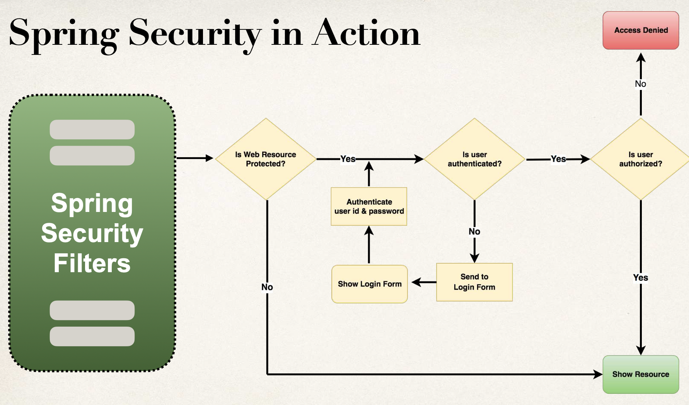

# 05-spring-boot-rest-api-security

`https://docs.spring.io/spring-security/reference/`

Veremos:

- Securizar Spring Boot REST APIs
- Definir usuarios y roles
- Proteger URLs basados en roles
- Almacenar usuarios, password y roles en BD (texto plano -> encriptado)

Spring Security Model

- Spring Security define un framework para seguridad
- Implementado usando Servlet Filters en segundo plano
- Hay dos métodos de securizar una app: declarativa y programática

Spring Security con Servlet Filters

- Servlet Filters se usan para preprocesar / postprocesar peticiones web
- Servlet Filters pueden enrutar peticiones web basadao en lógica de seguridad
- Spring provee una gran cantidad de funciones de seguridad con servlet filters

Visión Spring Security

```
Web       ---->  Spring Security  ---->   Recurso Web
Browser   <----     Filters       <----   Protegido (/mytopsecretstuff)
                       |
                       |-> configuración          usuarios
                           seguridad my app --->  passwords
                                                  roles
```



Conceptos de Seguridad

- Autenticación: comprobar id de usuario y password contra las credenciales almacenadas en app / db
- Autorización: comprobar si un usuario tiene un rol autorizado

Seguridad Declarativa

- Definir restricciones de seguridad de la app en la configuración
  - @Configuration
- Provee separación de cometidos entre el código de la app y seguridad

Seguridad Programática

- Spring Security provee una API para personalizar la codificación de la seguridad
- Provee una gran personalización para requerimientos específicos de la app

Habilitar Spring Security

- Editar pom.xml y añadir spring-boot-starter-security
- Con esto, automáticamente se securizan todos los endpoints de la app

Endpoints Securizados

- Cuando accedamos a nuestra app, Spring Security pedirá un login
- El usuario por defecto será user y el password se genera automáticamente al arrancar la app (en la consola)
- Esto es para testing. Todo esto se puede personalizar en el fichero application.properties
  - spring.security.user.name=jmmunoz
  - spring.security.user.password=my_password

Autenticación y Autorización

Usuarios, passwords y roles se pueden configurar en:

- Memoria
- JDBC
- LDAP
- Personalizado / Enchufable

En esta sección se va a cubrir el password almacenado en BD como texto plano y encriptado.

### 00-spring-boot-rest-security-employee-starter-code

Para el proyecto se usa MariaDB y uso esta imagen Docker:

```
  docker container run \
  -e MARIADB_USER=springstudent \
  -e MARIADB_PASSWORD=springstudent \
  -e MARIADB_ROOT_PASSWORD=springstudentroot \
  -e MARIADB_DATABASE=student_tracker \
  -dp 3306:3306 \
  --name student_tracker \
  --volume student_tracker:/var/lib/mysql \
  mariadb:jammy
```

Y para gestionar la BBDD uso el programa SQuirreL.

Ejecutar las consultas del archivo `employee-directory.sql` para crear una nueva tabla de BBDD llamada employee y poblarla de datos de prueba.

El archivo se encuentra en el directorio `spring-boot-employee-sql-script`

Añadimos la dependencia al POM

```
		<dependency>
			<groupId>org.springframework.boot</groupId>
			<artifactId>spring-boot-starter-security</artifactId>
		</dependency>
```

Y para testear vamos a la ruta `http://localhost:8080/api/employees`

Sin modificar application.properties. Nos saldrá una página de login donde el usuario es user y el password aparece en la consola al ejecutar la app.

Modificando application.properties podemos indicar el usuario y el password que queramos.
