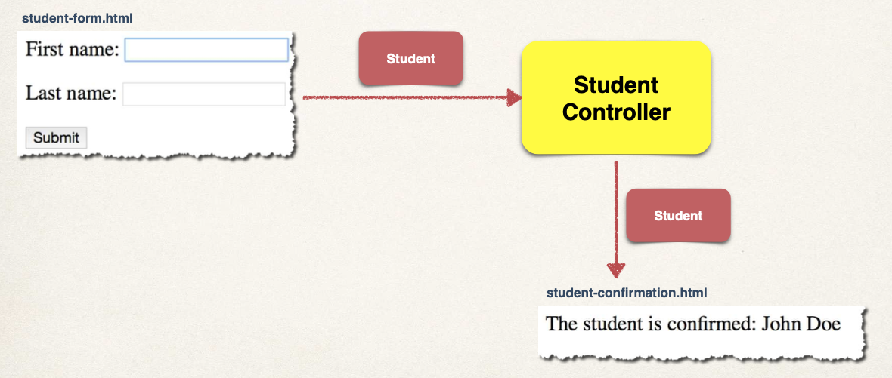
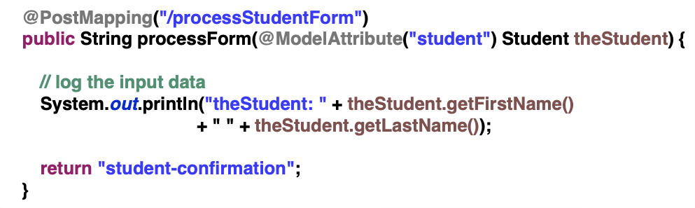
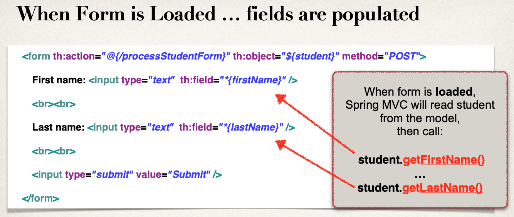
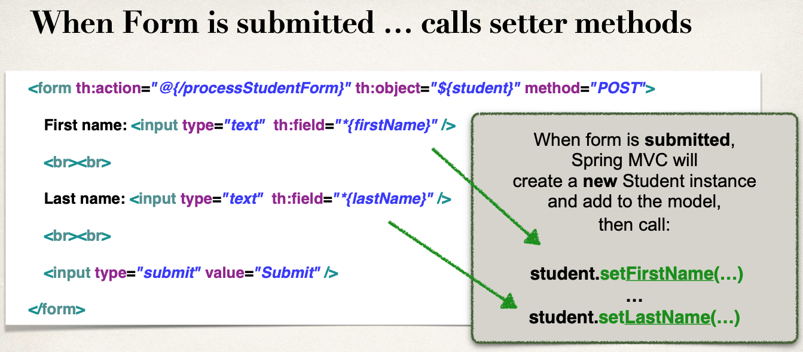
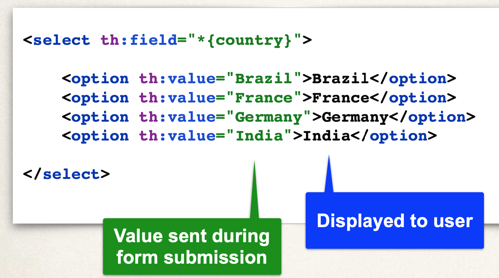
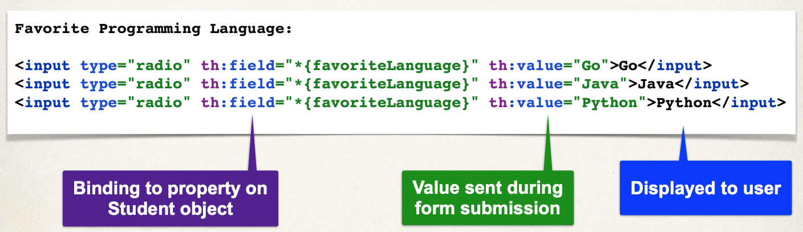
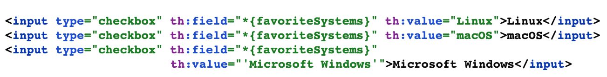

# 06-spring-boot-mvc

MVC con Thymeleaf.

`https://www.thymeleaf.org/`

Vamos a ver estas secciones de MVC sin prestar tanta atención a Thymeleaf porque mi objetivo es usar React o Angular.

Tutorial Patrón DTO, que no se ve en el curso: `https://www.youtube.com/watch?v=5yquJa2x3Ko`

Todo lo que pueda aprender de Thymeleaf bienvenido sea, pero no quiero profundizar mucho.

Pasos:

- Añadir Thymeleaf al fichero Maven POM:


Y ya está, no hace falta añadir más configuración para poder usar Thymeleaf con Spring Boot.

- Desarrollar un Controller Spring MVC

Como se ha hecho hasta ahora en REST, usando la anotación @Controller.


Se indica en la imagen que se buscará automáticamente una plantilla helloworld.html

En Spring Boot, las plantillas de Thymeleaf hay que dejarlas, por defecto, en la siguiente carpeta: `src/main/resources/templates` y los ficheros tendrán extensión `.html`

- Crear una plantilla Thymeleaf, es decir, un fichero html


Características adicionales:

- Bucles y condicionales
- Integración de CSS y JavaScript
- Diseños de plantillas y fragmentos

## 01-thymeleaf-helloworld

Un sencillo ejemplo con Thymeleaf. Hay un controller y un template hecho con Thymeleaf.

Para testear ejecutar el proyecto e ir a la ruta: `http://localhost:8080/hello`

Podemos añadir CSS de las siguientes maneras:

- Fichero CSS local como parte del proyecto
- Referenciar ficheros CSS remotos

Proceso de desarrollo:

- Crear fichero CSS
  - Spring Boot buscará recursos estáticos en el directorio: `src/main/resources/static`
  - Nosotros, dentro de static, crearemos el directorio css y dentro el fichero demo.css
- Referenciar CSS en plantilla Thymelef
  - 
- Aplicar estilo CSS
  - 

Spring Boot buscará (de arriba a abajo) recursos estáticos en los siguientes directorios:

- /src/main/resources
  - /META-INF/resources
  - /resources/
  - /static
  - /public

Lo más normal en proyectos reales es situar los recursos estáticos en las carpetas /static o /public

Uso de Librerías CSS como Bootstrap

- Instalación local
  - Descargar el fichero Bootstrap y añadirlo al directorio /static/css
  - Lo referenciamos
    - 
- Uso de fichero Bootstrap CDN
  - 

Componentes de una aplicación Spring MVC

- WEB PAGES: Páginas Web para diseñar componentes UI
- BEANS: Una colección de Spring Beans (controllers, services, etc...)
- SPRING CONFIGURATION: Configuración Spring (XML, Anotaciones o Java)


Leer Datos de Formulario con Spring MVC


La clave es entender que vamos a usar un controlador (HelloWorldController) para manejar dos peticiones.


Proceso de desarrollo:

- Crear clase Controller
- Mostrar formulario HTML
  - Crear método en el controlador para mostrar formulario HTML
  - Crear View para el formulario HTML
- Procesar formulario HTML
  - Crear método en el controlador para procesar formulario HTML
  - Desarrollar View de confirmación

Para testear ejecutar el proyecto e ir a la ruta: `http://localhost:8080/showForm`

Añadir data al Model Spring MVC

- El Model es un contenedor para los datos de la aplicación
- En el controlador:
  - Se puede poner cualquier cosa en el modelo
  - cadenas, objetos, info de la BD, etc...
- La página View puede acceder a la data desde el model.

Como ejemplo:

- Queremos crear un nuevo método para procesar data de formulario
- Leemos la data del formulario: student's name
  - HttpServletRequest request
  - request.getParameter("studentName");
- Convertimos el nombre a mayúsculas
- Añadimos la versión en mayúsculas al model
  - model.addAttribute("message", result);
- En la plantilla View obtenemos el dato que añadimos antes al model. Notar que el atributo (message) tiene que ser el mismo
  - <span th:text="${message}" />

Para testear ejecutar el proyecto e ir a la ruta: `http://localhost:8080/showForm`

Leer data de formulario HTML con la anotación @RequestParam

- En vez de usar HttpServletRequest y luego request.getParameter utilizamos otra técnica propia de Spring
  - @RequestParam("studentName") String theName

Para testear ejecutar el proyecto e ir a la ruta: `http://localhost:8080/showForm`

GetMapping y PostMapping

- Con un método HTTP GET, la data del formulario se añade al final de la URL en la forma nombre/pares de valores
  - theUrl?field1=value1&field2=value2...
  - @RequestMappint("/endpoint") sirve para manejar el envío de datos de formulario, para todos los tipos de métodos HTTP
  - @GetMapping("/processForm") solo maneja métodos HTTP GET
- Cuándo usar GET
  - Bueno para hace debug
  - Marcador o email URL
  - Limitaciones en la longitud de la data (1000 caractéres)
- Enviar data con un método HTTP POST
  - La data se envía en el body del mensaje de la petición HTTP
  - Ejemplo solo para POST: @RequestMapping(path="/processForm", method=RequestMethod.POST)
  - @PostMapping("/processForm") solo maneja métodos HTTP POST
- Cuándo usar POST
  - No se puede marcar o email URL
  - No tiene limitaciones en la longitud de la data
  - Puede enviarse código binario

Para testear ejecutar el proyecto e ir a la ruta: `http://localhost:8080/showForm`

Spring MVC Form Data Binding - Campos de Texto



- Los formularios de Spring MVC pueden hacer uso de data binding
- Esto es, automáticamente establecen / recuperan data de un objeto / bean de Java
- En nuestro controller de Spring
  - Antes de mostrar el formulario, debes añadir un model attribute
  - Esto es un bean que retiene datos del formulario para el data binding
  - 
- 
- 

Proceso de desarrollo:

- Crear clase Student
- Cerar clase controlador StudentController
- Crear formulario HTML
- Crear código de procesamiento de formulario
- Crear página de confirmación

Para testear ejecutar el proyecto e ir a la ruta: `http://localhost:8080/showStudentForm`

Spring MVC Form Data Binding - Listas Drop down



Proceso de desarrollo:

- Actualizar formulario HTML
- Actualizar clase Student - añadir getter/setter para la nueva property
- Actualizar página de confirmación

Para testear ejecutar el proyecto e ir a la ruta: `http://localhost:8080/showStudentForm`

Si queremos que los valores no aparezcan hardcodeados en la página HTML, podemos ponerlos en el fichero properties y leerlos de ahí.

Proceso de desarrollo:

- Añadir lista de paises al fichero application.properties
- Inyectar los paises en StudentController usando la anotación @Value
- Añadir la lista de paises al model
- En el formulario HTML, generar lista de tags <option> para los paises

Para testear ejecutar el proyecto e ir a la ruta: `http://localhost:8080/showStudentForm`

Spring MVC Form Data Binding - Radio buttons



Proceso de desarrollo:

- Actualizar formulario HTML
- Actualizar clase Student - añadir getter/setter para la nueva property
- Actualizar página de confirmación

Para testear ejecutar el proyecto e ir a la ruta: `http://localhost:8080/showStudentForm`

Si queremos que los valores no aparezcan hardcodeados en la página HTML, podemos ponerlos en el fichero properties y leerlos de ahí.

- Añadir lista de lenguajes de programación al fichero application.properties
- Inyectar los lenguajes de programación en StudentController usando la anotación @Value
- Añadir la lista de lenguajes de programación al model
- En el formulario HTML, generar lista de tags <input> para los lenguajes de programación

Para testear ejecutar el proyecto e ir a la ruta: `http://localhost:8080/showStudentForm`

Spring MVC Form Data Binding - Check Box



Proceso de desarrollo:

- Actualizar formulario HTML
- Actualizar clase Student - añadir getter/setter para la nueva property
- Actualizar página de confirmación

Para testear ejecutar el proyecto e ir a la ruta: `http://localhost:8080/showStudentForm`

Si queremos que los valores no aparezcan hardcodeados en la página HTML, podemos ponerlos en el fichero properties y leerlos de ahí.

- Añadir lista de Sistemas Operativos al fichero application.properties
- Inyectar los Sistemas Operativos en StudentController usando la anotación @Value
- Añadir la lista de Sistemas Operativos al model
- En el formulario HTML, generar lista de tags <input> para los Sistemas Operativos

Para testear ejecutar el proyecto e ir a la ruta: `http://localhost:8080/showStudentForm`

```
In Spring MVC, when a request is made to a controller method, the framework is responsible for creating instances of certain objects and passing them as arguments to the method. This process is known as argument resolution.

Here are some commonly used objects that can be passed as method parameters in a Spring MVC controller:

1. Model: The Model interface is provided by Spring to pass data between the controller and the view. When you include a Model parameter in your controller method, Spring automatically provides an instance of it.

@Controller
public class MyController {

    @RequestMapping("/example")
    public String example(Model model) {
        // Use the model to add attributes
        model.addAttribute("message", "Hello, World!");
        return "example-view";
    }
}


2. HttpServletRequest and HttpServletResponse: You can include HttpServletRequest and HttpServletResponse as parameters in your method to gain access to the raw HTTP request and response.

@RequestMapping("/example")
public String example(HttpServletRequest request, HttpServletResponse response) {
    // Access request and response objects
    // ...
    return "example-view";
}


3. @RequestParam: Use @RequestParam to extract values from query parameters or form data.

@RequestMapping("/example")
public String example(@RequestParam String name) {
    // Use the value of the 'name' parameter
    // ...
    return "example-view";
}


4. @PathVariable: Extract values from URI templates.

@RequestMapping("/example/{id}")
public String example(@PathVariable Long id) {
    // Use the value of the 'id' path variable
    // ...
    return "example-view";
}


5. @RequestBody: Extract the entire request body.

@PostMapping("/example")
public String example(@RequestBody String requestBody) {
    // Process the entire request body
    // ...
    return "example-view";
}


The instances of these objects are typically created and managed by the Spring MVC framework through various resolvers. Spring uses reflection and other mechanisms to populate these parameters with the appropriate values before invoking the controller method.

The actual creation and population depend on the specific resolver used, and Spring has default resolvers for common types. You can also customize this process by creating custom argument resolvers if needed.
```
