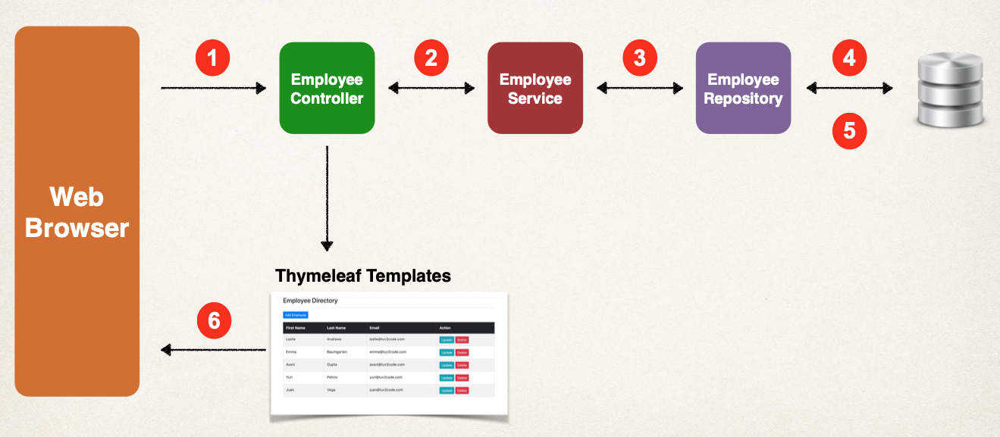

# 07-spring-boot-mvc-crud

Se va a realizar un proyecto MVC CRUD usando Thymeleaf y Spring Boot.

Es el mismo proyecto que se hizo para REST, por lo que mucho código ya está hecho y lo que hacemos es crear el Controller y las Views.



**Configuración de BBDD**

Para el proyecto se usa MariaDB y uso esta imagen Docker:

```
  docker container run \
  -e MARIADB_USER=springstudent \
  -e MARIADB_PASSWORD=springstudent \
  -e MARIADB_ROOT_PASSWORD=springstudentroot \
  -e MARIADB_DATABASE=student_tracker \
  -dp 3306:3306 \
  --name student_tracker \
  --volume student_tracker:/var/lib/mysql \
  mariadb:jammy
```

Y para gestionar la BBDD uso el programa SQuirreL.

Ejecutar las consultas del archivo `sql-scripts/employee-directory.sql` para crear una nueva tabla de BBDD llamada employee y poblarla de datos de prueba.

Usamos Bootstrap.

En la página https://getbootstrap.com/docs/5.3/getting-started/introduction/ cogemos el código siguiente y lo llevamos a list-employees.html

```
    <link href="https://cdn.jsdelivr.net/npm/bootstrap@5.3.2/dist/css/bootstrap.min.css" rel="stylesheet" integrity="sha384-T3c6CoIi6uLrA9TneNEoa7RxnatzjcDSCmG1MXxSR1GAsXEV/Dwwykc2MPK8M2HN" crossorigin="anonymous">
```

Para testear ejecutar el proyecto y:

- Get Employees: `http://localhost:8080/employees/list`
  - Se ha creado también en /resources/static/index.html una página que se cargará automáticamente si no se da ninguna url, es decir, `http://localhost:8080`. El contenido de index.html es:
  ```
      <meta http-equiv="refresh" content="0; URL='employees/list'" />
  ```
  Y nos lleva a Get Employees.
