# 08-spring-boot-mvc-security

Cosas que vamos a aprender:

- Securizar Apps Web hechas con Spring MVC
- Desarrollar páginas de login (por default y personalizadas)
- Definir usuarios y roles con simple authentication
- Proteger URLs basado en roles
- Ocultar/mostrar contenido basado el roles
- Almacenar usuarios, passwords y roles en BD (primero en texto plano y luego encriptado)

Spring Security Model

- Spring Security define un framework para seguridad
- Implementado usando Servlet Filters en segundo plano
- Hay dos métodos de securizar una app: declarativa y programática

Spring Security con Servlet Filters

- Servlet Filters se usan para preprocesar / postprocesar peticiones web
- Servlet Filters pueden enrutar peticiones web basadao en lógica de seguridad
- Spring provee una gran cantidad de funciones de seguridad con servlet filters

Visión Spring Security

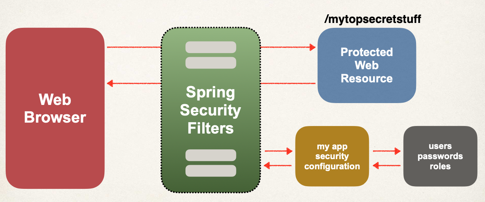

Spring Security en Acción

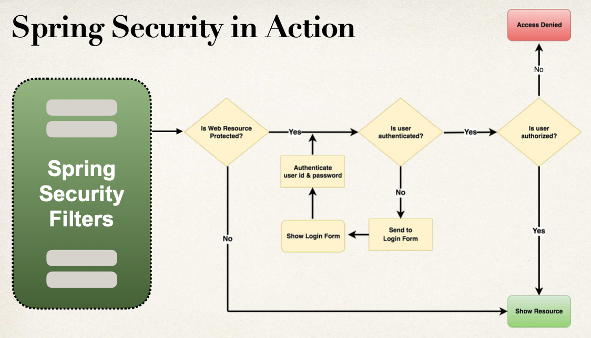

Conceptos de Seguridad

- Autenticación: comprobar id de usuario y password contra las credenciales almacenadas en app / db
- Autorización: comprobar si un usuario tiene un rol autorizado

Seguridad Declarativa

- Definir restricciones de seguridad de la app en la configuración
  - @Configuration
- Provee separación de cometidos entre el código de la app y seguridad

Seguridad Programática

- Spring Security provee una API para personalizar la codificación de la seguridad
- Provee una gran personalización para requerimientos específicos de la app

Habilitar Spring Security

- Editar pom.xml y añadir spring-boot-starter-security
- Con esto, automáticamente se securizan todos los endpoints de la app

Endpoints Securizados

- Cuando accedamos a nuestra app, Spring Security pedirá un login
- El usuario por defecto será user y el password se genera automáticamente al arrancar la app (en la consola)
- Esto es para testing. Todo esto se puede personalizar en el fichero application.properties
  - spring.security.user.name=jmmunoz
  - spring.security.user.password=my_password

Diferentes métodos para hacer Login

- HTTP Basic Authentication
  - Feo. No se usa en el curso
  - 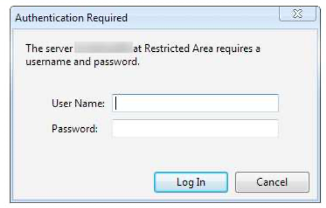
- Formulario login por defecto
  - Spring Security provee un formulario login por defecto
  - 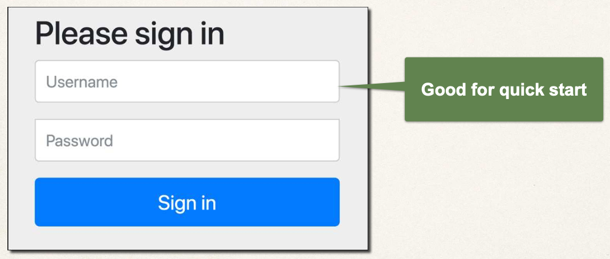
- Formulario login personalizado
  - Nuestro propio look-and-feel, HTML + CSS
  - 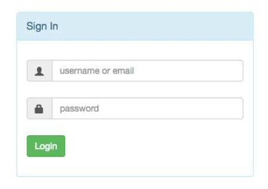

## 01-spring-boot-spring-mvc-security-default

Se va a realizar un proyecto MVC Security, usando además MVC Web App y Thymeleaf.

`https://docs.spring.io/spring-security/reference/`

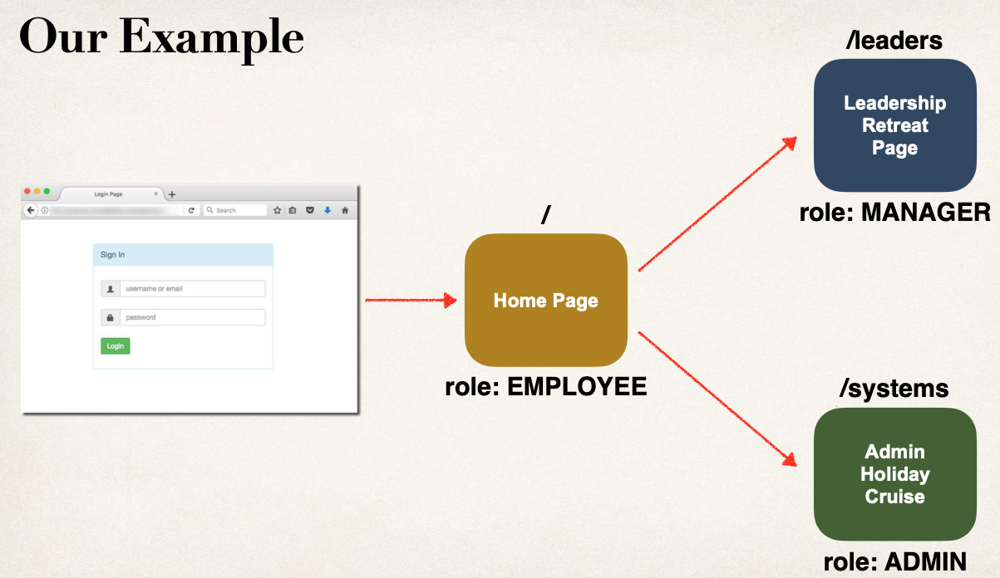

Proceso de desarrollo del proyecto:

- Crear un proyecto Spring usando VSCode
  - Añadir dependencias para Spring MVC Web App, Security, Thymeleaf
  - 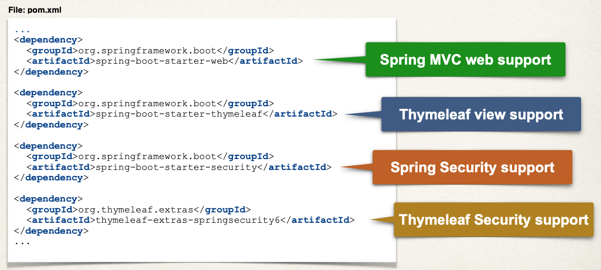
- Desarrollar nuestro controller Spring
  - 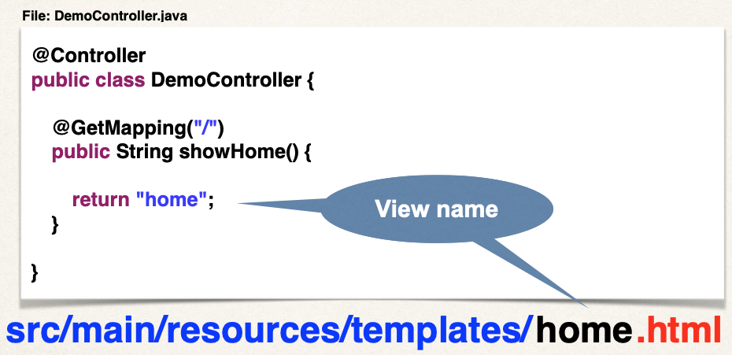
- Desarrollar nuestra view con Thymeleaf
  - 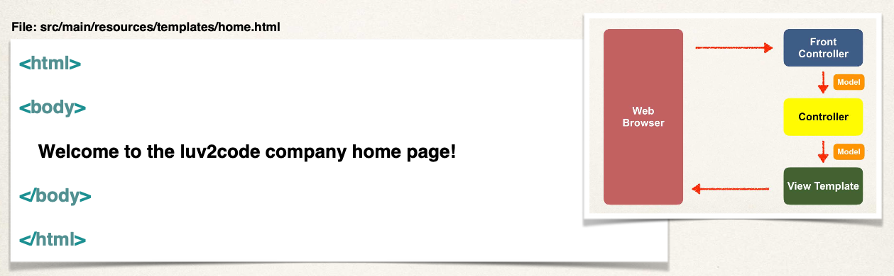

Para testear ir a la siguiente URL: `http://localhost:8080`

Veremos el formulario login por defecto suministrado por Spring Security.

- Usuario: user
- Password: aparece en la consola donde se ejecuta Spring

NOTA: En las herramientas de desarrollador ir a la pestaña Application y luego, en la parte izquierda seleccionar Cookies y eliminar la entrada con el usuario y password, asociada a la ejecución de nuestra app, si queremos que nos vuelva a salir la pantalla de login. Si no, tras hacer login la primera vez, el usuario aparecerá como loggeado siempre, ya que está basado en una sesión de navegador.

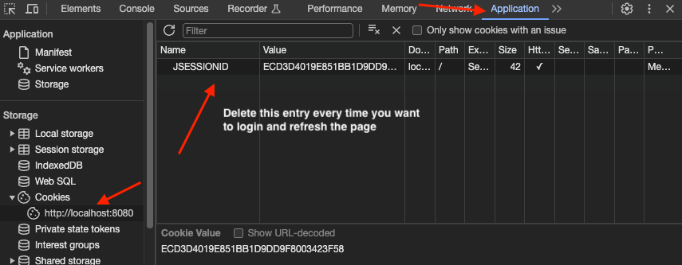

Esto es un problema que solo se da durante desarrollo y testing. No se da en producción.

```
Spring Boot stores the session data in a serialized file between restarts. The session cookies have a default timeout of 30 minutes. So as long as you restart within that time period, you can reattach to the older session using the session id (from the client browser) ... hence no prompts to re-login.

The feature is enabled by default if you make use of Spring Dev Tools (spring-boot-devtools) in pom file. If you don't use Spring Dev tools, then you can set the properties accordingly in the application.properties file.

server.servlet.session.persistent=false # Whether to persist session data between restarts.
server.servlet.session.timeout=30m # Session timeout. If a duration suffix is not specified, seconds will be used.

The properties are mentioned in the Spring Boot Reference Manual - Customizing Embedded Servlet Containers

You can also find additional properties here:

https://docs.spring.io/spring-boot/docs/current/reference/html/common-application-properties.html

Just search for "server.servlet.session"
```

**Configurar Seguridad Básica**

Proceso de desarrollo:

- Crear una clase de configuración de Spring Security
  - Usar anotación @Configuration
- Añadir usuarios, passwords y roles

En Spring Security los passwords se almacenan usando un formato específico `{id}encodedPassword`

Donde id puede valer:

- noop -> password en texto plano
- bcrypt -> hashing de password BCrypt

Ejemplo: {noop}test123

Para añadir los usuarios, password y roles, para empezar los vamos a añadir en memoria.

- Se crea un método en la clase de configuración (la anotada con @Configuration) que devuelve un InMemoryUserDetailsManager
- Se usa una clase UserDetails de la siguiente forma

```
  UserDetails mary = User.builder()
            .username("mary")
            .password("{noop}test123")
            .roles("EMPLOYEE", "MANAGER")
            .build();

  return new InMemoryUserDetailsManager(mary);
```

Al añadirlos usando la clase de configuración, Spring Boot no usará el usuario/password del fichero properties.

Para testear ir a la siguiente URL: `http://localhost:8080`

- Indicar como usuario: john
- Indicar como password: test123

**Formulario con Login personalizado**

Proceso de desarrollo:

- Modificar la configuración de Spring Security para que vaya a nuestro formulario de login personalizado
  - 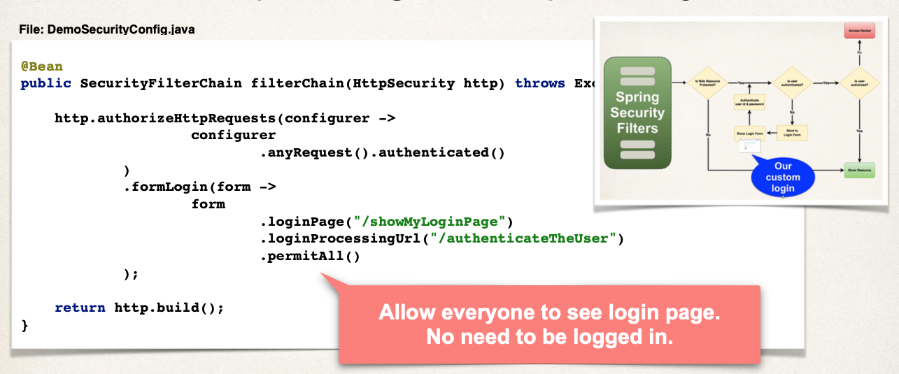
- Desarrollar un Controller que muestre el formulario de login personalizado
  - Dada nuestra imagen anterior, el controller tendrá un @GetMapping("/showMyLoginPage")
  - No hace falta un request mapping para "/authenticateTheUser". Lo hace Spring automáticamente
- Crear el formulario de login personalizado
  - HTML (CSS opcional)
  - Mandaremos a procesar la data indicada en el login a la URL /authenticateTheUser, que fue la indicada en la imagen. No hace falta hacer ningún código ya que lo maneja Spring Security automáticamente

A la hora de crear el formulario de login personalizado hay que tener en cuenta que:

- Spring Security define nombres por defecto para los campos del formulario de login
  - Campo nombre del usuario: username
  - Campo password: password
  - Spring Security Filters leerá la data del formulario y autenticará el usuario

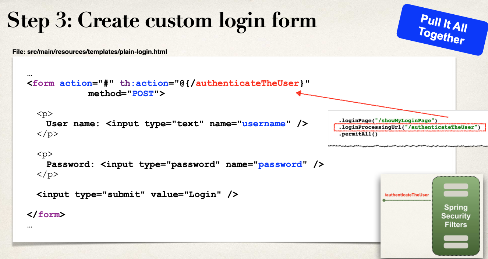

Para testear ir a la siguiente URL: `http://localhost:8080`

- Indicar como usuario: john
- Indicar como password: test123

Notar que si indicamos un passord erroneo no indica ningún tipo de error.

Esto es porque hemos decidido hacer el login personalizado, y eso incluye el tratamiento de errores.

**Formulario de Login Mensajes de Error**

Cuando el login falla, por defecto Spring Security:

- Devuelve al usuario a la página de login
- Añade a la url un parámetro error: `?error`

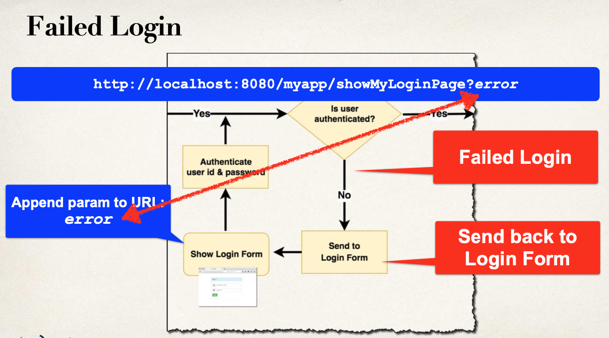

Proceso de desarrollo:

- Modificar el formulario de login personalizado
  - Chequear el parámetro error
  - Si el parámetro error existe, mostrar un mensaje de error

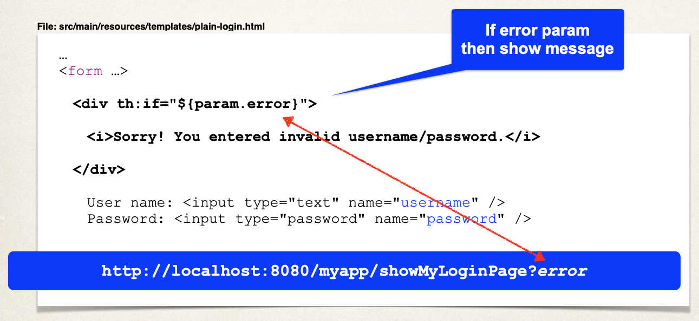

Para testear ir a la siguiente URL: `http://localhost:8080`

- Indicar como usuario: john
- Indicar como password uno erroneo, por ejemplo: 1234

**Formulario de Login personalizado con Bootstrap**

Nuestro formulario de login personalizado es muy feo. Lo vamos a mejorar usando Bootstrap.

Se ha descargado del curso el template de login con nombre: `fancy-login.html`

Proceso de desarrollo:

- Modificar el formulario para apuntar a nuestra URL de procesamiento de login
- Verificar que los campos del formulario se llaman username y password
- Cambiar nuestro controlador para usar nuestro formulario de login hecho en Bootstrap

Documentación de Bootstrap:

- https://www.w3schools.com/bootstrap/
- https://getbootstrap.com/docs/5.3/getting-started/introduction/

Para testear ir a la siguiente URL: `http://localhost:8080`

- Indicar como usuario: john
- Indicar como password uno erroneo, por ejemplo: 1234

Luego:

- Indicar como usuario: john
- Indicar como password el correcto: test123

**Logout**

Añadiremos un botón de Logout. Al pulsarlo se limpiará la sesión del usuario y se redireccionará a la página de login.

Proceso de desarrollo:

- Añadir el soporte de logout a la Configuración de Spring Security
  - `.logout(logout -> logout.permitAll());`
  - El URL por defecto es /logout
  - La URL de logout la manejará automáticamente Spring Security Filters
- Añadir un botón de logout a home.html
  - Envía la data a la URL por defecto /logout
  - El método es POST (Get está deshabilitado por defecto)
  - Es necesario un formulario para poder hacer el logout (th:action y el method)
- Actualizar nuestro formulario de login para mostrar un mensaje "logged out"

En un proceso de Logout Spring Security hará:

- Invalidar la sesión HTTP del usuario y eliminar los cookies de la sesión, etc.
- Devolver al usuario a la página de login
- Añadir un parámetro de logout: `?logout`
  - Podemos chequear este parámetro para mostrar un mensaje de logout

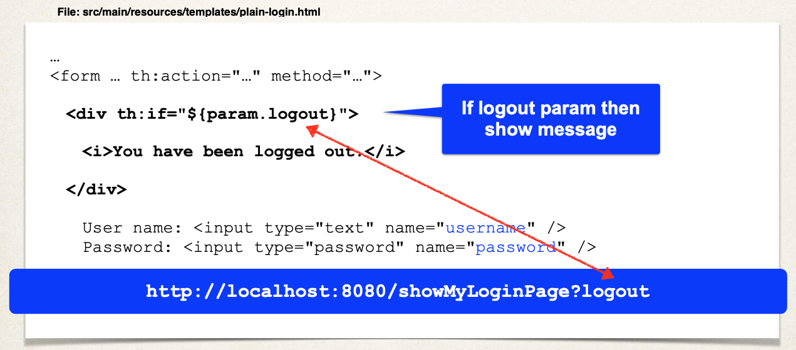

Para testear ir a la siguiente URL: `http://localhost:8080`

- Indicar como usuario: john
- Indicar como password: test123
- Pulsar el botón logout

```
>> We don't need to write the redirect to the login page? How this logout works?

This support is built into Spring Security by default. Spring Security will automatically log out and send to the login page.

>> Can I change it to other directory?

Yes, you can. Add a config for the logoutSuccessUrl(...). Here's an example

                .logout(logout ->
                        logout
                                .permitAll()
                                .logoutSuccessUrl("/")
                )

This will send to the root of your application (assuming it is unsecured). You can send to an unsecured location of your application.

>> Login success, we are redirect to the root ("/") directory automatically?

Login success will redirect to root ("/") directory automatically ... however, if the user attempted to access another protected path, then it will redirect to that path instead.

>> Can I change it?

Yes, you can. Add a config for the defaultSuccessUrl(...). Here's an example

                .formLogin(form ->
                        form
                                .loginPage("/showMyLoginPage")
                                .loginProcessingUrl("/authenticateTheUser")
                                .permitAll()
                                .defaultSuccessUrl("/home", true)
```

**Mostrar User ID y Roles**

Spring Security da soporte para acceder al id de usuario y sus roles

Proceso de desarrollo:

- XML Namespace
  - xmlns:sec="http://www.thymeleaf.org/extras/spring-security"
- Mostrar User ID
  - sec:authentication="principal.username"
- Mostrar roles de usuario
  - sec:authentication="principal.authorities"
  - authorities es lo mismo que user roles

Para testear ir a la siguiente URL: `http://localhost:8080`

- Indicar como usuario: mary
- Indicar como password: test123

```
Let's assume you have an additional field on the User entity:

@Column(name = "email")
private String email;

You would also like to display the user's email in the application.

---

Create a Custom AuthenticationSuccessHandler

You can create a custom AuthenticationSuccessHandler. The AuthenticationSuccessHandler is an interface that allows you to customize the behavior that occurs after a successful authentication attempt. When a user successfully logs in, Spring Security invokes the onAuthenticationSuccess method of the AuthenticationSuccessHandler implementation you provide. This gives you the opportunity to perform certain actions or redirect the user to a specific page after they have been successfully authenticated.

In our case, we will place the User object in the HTTP session. This will allow to access it later to display on Thymeleaf pages or use in other areas of our application.

Here's the code for the AuthenticationSuccessHandler

package com.luv2code.springboot.demosecurity.security;

import java.io.IOException;

import com.luv2code.springboot.demosecurity.entity.User;
import com.luv2code.springboot.demosecurity.service.UserService;
import jakarta.servlet.ServletException;
import jakarta.servlet.http.HttpServletRequest;
import jakarta.servlet.http.HttpServletResponse;
import jakarta.servlet.http.HttpSession;
import org.springframework.security.core.Authentication;
import org.springframework.security.web.authentication.AuthenticationSuccessHandler;

public class CustomAuthenticationSuccessHandler implements AuthenticationSuccessHandler {

    private UserService userService;

    public CustomAuthenticationSuccessHandler(UserService userService) {
        this.userService = userService;
    }

    @Override
    public void onAuthenticationSuccess(HttpServletRequest request, HttpServletResponse response, Authentication authentication)
            throws IOException, ServletException {

        System.out.println("\n\nIn customAuthenticationSuccessHandler\n\n");

        String userName = authentication.getName();

        System.out.println("userName=" + userName);

        User theUser = userService.findByUserName(userName);

        // now place in the session
        HttpSession session = request.getSession();
        session.setAttribute("user", theUser);

        // forward to home page

        response.sendRedirect(request.getContextPath() + "/");
    }
}


The key section of code is this:

		User theUser = userService.findByUserName(userName);

		// now place in the session
		HttpSession session = request.getSession();
		session.setAttribute("user", theUser);

We retrieve the User from the database and store it in the HttpSession.


----

Configure SpringSecurity to use Custom AuthenticationSuccessHandler

In the Spring Security config, you need to configure a reference to the custom AuthenticationSuccessHandler

File: DemoSecurityConfig.java

Add this snippet

                .formLogin(form ->
                        form
                                .loginPage("/showMyLoginPage")
                                .loginProcessingUrl("/authenticateTheUser")
                                .successHandler(new CustomAuthenticationSuccessHandler(userService))
                                .permitAll()
                )

Make note of the entry

                                .successHandler(new CustomAuthenticationSuccessHandler(userService))

Here's the full code for the security config


package com.luv2code.springboot.demosecurity.security;

import com.luv2code.springboot.demosecurity.service.UserService;

import org.springframework.context.annotation.Bean;
import org.springframework.context.annotation.Configuration;
import org.springframework.security.authentication.dao.DaoAuthenticationProvider;
import org.springframework.security.config.annotation.web.builders.HttpSecurity;
import org.springframework.security.crypto.bcrypt.BCryptPasswordEncoder;
import org.springframework.security.provisioning.JdbcUserDetailsManager;
import org.springframework.security.provisioning.UserDetailsManager;
import org.springframework.security.web.SecurityFilterChain;

import javax.sql.DataSource;

@Configuration
public class DemoSecurityConfig {

    //bcrypt bean definition
    @Bean
    public BCryptPasswordEncoder passwordEncoder() {
        return new BCryptPasswordEncoder();
    }

    //authenticationProvider bean definition
    @Bean
    public DaoAuthenticationProvider authenticationProvider(UserService userService) {
        DaoAuthenticationProvider auth = new DaoAuthenticationProvider();
        auth.setUserDetailsService(userService); //set the custom user details service
        auth.setPasswordEncoder(passwordEncoder()); //set the password encoder - bcrypt
        return auth;
    }

    @Bean
    public SecurityFilterChain filterChain(HttpSecurity http, UserService userService) throws Exception {

        http.authorizeHttpRequests(configurer ->
                        configurer
                                .requestMatchers("/").hasRole("EMPLOYEE")
                                .requestMatchers("/leaders/**").hasRole("MANAGER")
                                .requestMatchers("/systems/**").hasRole("ADMIN")
                                .requestMatchers("/register/**").permitAll()
                                .anyRequest().authenticated()
                )
                .formLogin(form ->
                        form
                                .loginPage("/showMyLoginPage")
                                .loginProcessingUrl("/authenticateTheUser")
                                .successHandler(new CustomAuthenticationSuccessHandler(userService))
                                .permitAll()
                )
                .logout(logout -> logout.permitAll()
                )
                .exceptionHandling(configurer ->
                        configurer.accessDeniedPage("/access-denied")
                );

        return http.build();
    }

}


----

Display User information in Thymeleaf template
Now that the User info is in the HttpSession, we can use this to display it in the Thymeleaf template.

File: home.html

<!-- display first name, last name and email -->
<div th:if="${session.user}" >
    <p th:text="'First name: ' + ${session.user.firstName} + ', Last name: ' + ${session.user.lastName} + ', Email: ' + ${session.user.email}"></p>
</div>

Notice this uses ${session.user.email} and similar thing for firstName and lastName. You can access any property that is defined on your User entity. During your design phase, you can add more properties to your User Entity such as company, city, state, whatever you would like based on your database table.

```

```
I have a problem with method findByUserName()

User theUser = userService.findByUserName(userName)

Can I get an access to it by extending some kind of interface or do I have to write this method on my own using JPA and SQL query?


Here is the code for UserService.java and UserServiceImpl.java. This will give you access to the method: findByUserName()


File: UserService.java

package com.luv2code.springboot.demosecurity.service;

import com.luv2code.springboot.demosecurity.entity.User;
import org.springframework.security.core.userdetails.UserDetailsService;

public interface UserService extends UserDetailsService {

	public User findByUserName(String userName);

}


File: UserServiceImpl.java

package com.luv2code.springboot.demosecurity.service;

import com.luv2code.springboot.demosecurity.dao.RoleDao;
import com.luv2code.springboot.demosecurity.dao.UserDao;
import com.luv2code.springboot.demosecurity.entity.Role;
import com.luv2code.springboot.demosecurity.entity.User;
import org.springframework.beans.factory.annotation.Autowired;
import org.springframework.security.core.GrantedAuthority;
import org.springframework.security.core.authority.SimpleGrantedAuthority;
import org.springframework.security.core.userdetails.UserDetails;
import org.springframework.security.core.userdetails.UsernameNotFoundException;
import org.springframework.stereotype.Service;

import java.util.Collection;
import java.util.stream.Collectors;

@Service
public class UserServiceImpl implements UserService {

	private UserDao userDao;

	private RoleDao roleDao;

	@Autowired
	public UserServiceImpl(UserDao userDao, RoleDao roleDao) {
		this.userDao = userDao;
		this.roleDao = roleDao;
	}

	@Override
	public User findByUserName(String userName) {
		// check the database if the user already exists
		return userDao.findByUserName(userName);
	}

	@Override
	public UserDetails loadUserByUsername(String userName) throws UsernameNotFoundException {
		User user = userDao.findByUserName(userName);
		if (user == null) {
			throw new UsernameNotFoundException("Invalid username or password.");
		}
		return new org.springframework.security.core.userdetails.User(user.getUserName(), user.getPassword(),
				mapRolesToAuthorities(user.getRoles()));
	}

	private Collection<? extends GrantedAuthority> mapRolesToAuthorities(Collection<Role> roles) {
		return roles.stream().map(role -> new SimpleGrantedAuthority(role.getName())).collect(Collectors.toList());
	}
}

```

**Restringir URLs basado en roles**

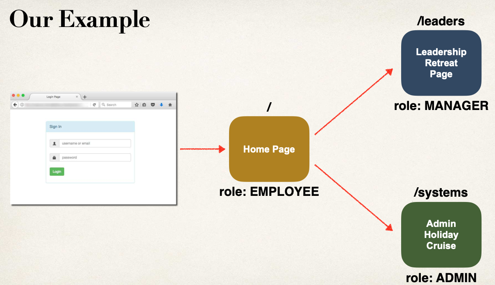

Proceso de desarrollo

- Crear código en el controller y views
- Restringir acceso basado en roles
  - Actualizar el fuente de configuración (.java) de Spring Security
  - Sintaxis General Un Role: `requestMatchers(<< add path to match on >>).hasRole(<< authorized role >>)`
    Ejemplo: requestMatchers("/leaders/\*\*").hasRole("MANAGER")
  - Sintaxis General Varios Roles: `requestMatchers(<< add path to match on >>).hasAnyRole(<< list of authorized roles >>)`
    - Ejemplo: .hasAnyRole("ADMIN", "DEVOLOPER", "VIP")

Para testear ir a la siguiente URL: `http://localhost:8080`

- Usuario sin acceso
- Indicar como usuario: john
- Indicar como password: test123

- Usuario con acceso a Leadership Meeting
- Indicar como usuario: mary
- Indicar como password: test123

- Usuario con acceso a Leadership Meeting y IT Systems Meeting
- Indicar como usuario: susan
- Indicar como password: test123

**Página personalizada de acceso denegado**

Proceso de desarrollo

- Configurar página personalizada para acceso denegado
  - .exceptionHandling(configurer -> configurer.accessDeniedPage("/access-denied"));
- Crear código en el controller y view

Para testear ir a la siguiente URL: `http://localhost:8080`

- Indicar como usuario: john
- Indicar como password: test123
- Pulsar Leadership Meeting

**Mostrar contenido basado en roles**

No tenemos que mostrar contenido (links en nuestro ejemplo) para los que distintos usuarios no tengan acceso, basado en su rol.

```
  <div sec:authorize="hasRole('MANAGER')">
      .....
  </div>
```

Para testear ir a la siguiente URL: `http://localhost:8080`

- Usuario sin acceso
- Indicar como usuario: john
- Indicar como password: test123

- Usuario con acceso a Leadership Meeting
- Indicar como usuario: mary
- Indicar como password: test123

- Usuario con acceso a Leadership Meeting y IT Systems Meeting
- Indicar como usuario: susan
- Indicar como password: test123

**JDBC Authentication - Cuentas de usuario almacenadas en BD - Texto Plano**

Para el proyecto se usa MariaDB y uso esta imagen Docker:

```
  docker container run \
  -e MARIADB_USER=springstudent \
  -e MARIADB_PASSWORD=springstudent \
  -e MARIADB_ROOT_PASSWORD=springstudentroot \
  -e MARIADB_DATABASE=student_tracker \
  -dp 3306:3306 \
  --name student_tracker \
  --volume student_tracker:/var/lib/mysql \
  mariadb:jammy
```

Y para gestionar la BBDD uso el programa SQuirreL.

Configuración de SQuirreL

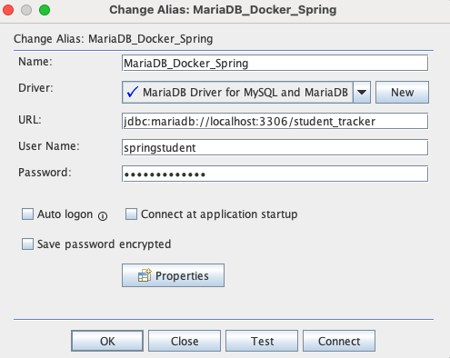

La contraseña es: `springstudent`

Hasta ahora, nuestras cuentas de usuario han sido hardcodeadas en el código fuente Java, para hacerlo más sencillo.

Vamos a añadir acceso a BD.

- Spring Security puede leer información de cuentas de usuario de BD, directamente
- Por defecto, hay que seguir los esquemas de tabla predefinidos por Spring Security
- De esta forma, hay muy poco código que escribir.

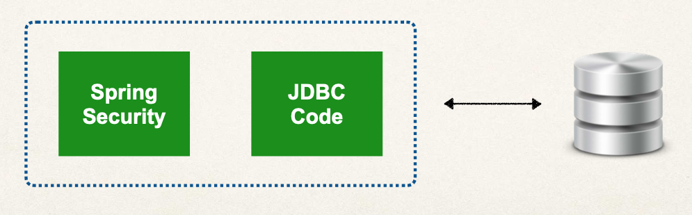

- También se puede personalizar los esquemas de tabla
- Esto es útil si tenemos tablas personalizadas específicas para nuestro proyecto
- Seremos entonces los responsables de desarrollar el código para acceder a la data
  - JDBC, JPA / Hibernate...

En este ejemplo seguiremos los esquemas de tabla predefinidos por Spring Security.

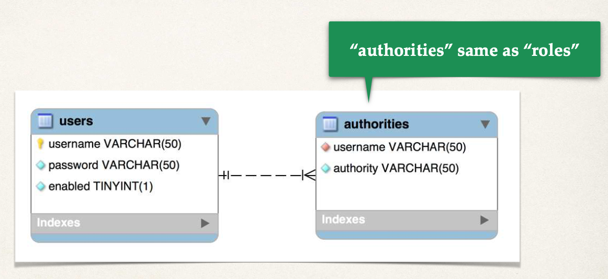

Proceso de desarrollo

- Desarrollar Scripts SQL para configurar las tablas de BD
  - Por ahora guardaremos el password en texto plano, pero luego usaremos bcrypt
  - Para los roles, Spring Security utiliza el prefijo ROLE\_
  - Ver carpeta `sql-scripts` en este proyecto, fichero `04-setup-spring-security-demo-database-plaintext.sql` y ejecutarlo en SQuirreL
  - Consultas:
    - `select * from employee_directory.employee`
    - `select * from employee_directory.users`
    - `select * from employee_directory.authorities`
- Añadir soporte de BD al fichero POM Maven
  - Usaremos MariaDB
  ```
  		<dependency>
  			<groupId>org.mariadb.jdbc</groupId>
  			<artifactId>mariadb-java-client</artifactId>
        <scope>runtime</scope>
  	</dependency>
  ```
- Crear propiedades JDBC en el fichero properties
  ```
    spring.datasource.url=jdbc:mariadb://localhost:3306/employee_directory
    spring.datasource.username=springstudent
    spring.datasource.password=springstudent
  ```
- Actualizar Spring Security Configuration para usar JDBC
  - Comentamos la parte en la que trabajábamos con usuarios en memoria

Para testear ir a la siguiente URL: `http://localhost:8080`

- Indicar como usuario: john
- Indicar como password: test123

- Indicar como usuario: mary
- Indicar como password: test123

**JDBC Authentication - Cuentas de usuario almacenadas en BD - Encriptación BCrypt**

- Spring Security recomienda usar el algoritmo BCrypt
- BCrypt realiza una encriptación hash de una vía
- Añade un salt aleatorio al password para proporcionar una protección adicional
- Incluye soporte para evitar un ataque por fuerza bruta
- Por qué deberíamos usar BCrypt: https://danboterhoven.medium.com/why-you-should-use-bcrypt-to-hash-passwords-af330100b861
- Descripción detallada del algoritmo BCrypt: https://en.wikipedia.org/wiki/Bcrypt
- Buenas prácticas de Password Hashing: https://crackstation.net/hashing-security.htm

Como obtener un password con BCrypt

- Opción 1: Usar un sitio web para realizar la encriptación. La haremos ahora
  - Ir a la ruta `https://www.bcryptcalculator.com/`
  - Escribimos el password en texto plano
  - La utilidad web nos generará un password BCrypt
  - Usaremos esos passwords encriptados, añadiéndolos a las cuentas de usuario en nuestra BD
- Opción 2: Escribir código Java para realizar la encriptación.

Proceso de desarrollo

- Ejecutar el Script SQL que contiene los passwords encriptados `sql-scripts/05-setup-spring-security-demo-database-bcrypt.sql`
  - Tenemos que modificar la DDL para el campo password, ya que la longitud tiene que ser como mínimo de 68 caracteres, correspondientes a 8 caracteres para {bcrypt} y 60 caracteres para el password codificado
  - El password encriptado es: fun123

Proceso de Login de Spring Security

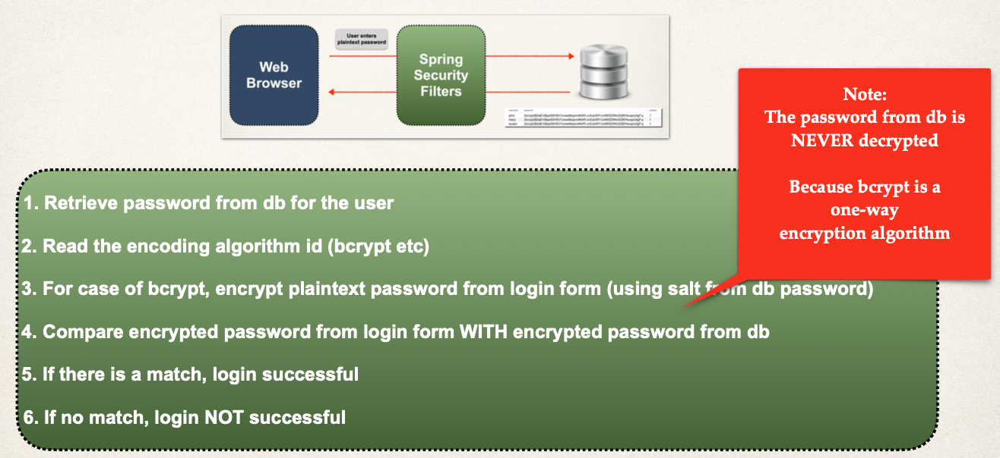

Para testear ir a la siguiente URL: `http://localhost:8080`

- Indicar como usuario: john
- Indicar como password: fun123

- Indicar como usuario: mary
- Indicar como password: fun123

**Spring Security - Autenticación JDBC - Tablas Personalizadas**

Hasta ahora hemos usado los esquemas de BD por defecto de Spring Security, es decir, las tablas users y authorities.

Funcionan bien, pero es restrictivo. ¿Qué pasa si en la empresa en la que trabajamos ya tiene sus propias tablas de BD de usuarios y roles, u otros nombres de campos?

Con Spring Security podemos usar, sin problema, nuestras propias tablas. Para ello:

- Tenemos que indicarle a Spring como consultar nuestras tablas personalizadas
- Proporcionar una query para encontrar un user por el nombre de usuario
- Proporcionar una query para encontrar authorities / roles por el nombre del usuario

Proceso de desarrollo:

- Si existen, eliminar las tablas authorities y users (en este orden)
  - drop table authorities;
  - drop table users;
- Crear nuestras tablas personalizadas con SQL
  - Ejecutar en SQuirreL el archivo `sql-scripts/06-setup-spring-security-demo-database-bcrypt-custom-table-names.sql`
    - Tabla de usuarios: members
      - El password encriptado es: fun123
    - Tabla de roles: roles
  - Actualizar la configuración de Spring Security (nuestro fuente DemoSecurityConfig.java)
    - Proporcionar una query para encontrar el user por el nombre de usuario
    - Proporcionar una query para encontrar authorities / roles por el nombre del usuario

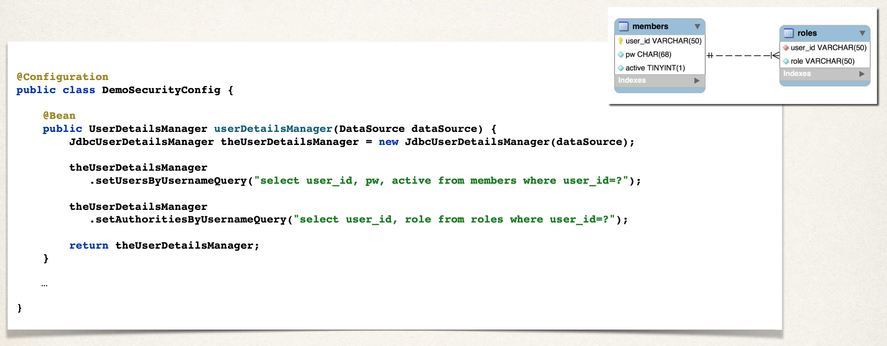

Para testear ir a la siguiente URL: `http://localhost:8080`

- Indicar como usuario: john
- Indicar como password: fun123

- Indicar como usuario: mary
- Indicar como password: fun123

## 02-spring-boot-spring-mvc-security-jpa-hibernate-bcrypt

Como añadir seguridad usando JPA/Hibernate en vez de JDBC.

Tenemos un pdf llamado `bonus-lecture-spring-boot-spring-mvc-security-security-jpa-hibernate-bcrypt.pdf`.

Seguirlo para comprender bien el proyecto.

Para testear ir a la siguiente URL: `http://localhost:8080`

- Indicar como usuario: john
- Indicar como password: fun123

- Indicar como usuario: mary
- Indicar como password: fun123
