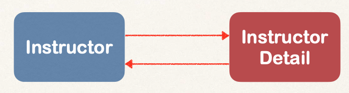

# 09-spring-boot-jpa-hibernate-advanced-mappings

Hasta ahora, se ha cubierto en el curso un mapeo muy básico, teniendo una clase Student que se mapea usando Hibernate a una tabla student.

Vamos a ver características más avanzadas.

En aplicaciones reales tendremos:

- Muchas tablas
- Relaciones entre tablas

Y vamos a modelar esto con Hibernate.

**Mapeos avanzados**

- Uno a uno
  - Dos tablas separadas
  - 
- Uno a muchos, muchos a uno
  - 
  - En el mapeo muchos a uno, muchos cursos pueden mapearse a un instructor
- Muchos a muchos
  - 

**Importantes Conceptos de BD**

- Primary Key
  - Identifica de forma unívoca una fila en una tabla
- Foreign Key
  - Usado para enlazar tablas
  - La utilidad principal es prevervar la relación entre tablas (integridad referencial), evitando operaciones que puedan destruir esta relación y asegurando que solo data válida es insertada en esa columna foreign key (exista en la primary key de la otra tabla)
  - Un campo en una tabla que hace referencia a la primary key de otra tabla
  - 
- Cascada
  - Consiste en aplicar la misma operación (save, delete, ...) a entidades relacionadas
  - Ejemplo: Si eliminamos un instructor, debemos eliminar su instructor_detail (CASCADE DELETE)
  - 
  - Hay que tener mucho cuidado a la hora de elegir si queremos o no hacer un delete en cascada

**Tipos de Fetch: Carga Eager vs Lazy**

Cuando nos traemos/recuperamos datos, ¿debemos recuperar todos?

- Eager: recupera todo
- Lazy: recupera al hacer una petición

**Relación Unidireccional**


**Relación Bidireccional**

Podemos acceder a Instructor Detail usando el Instructor o al Instructor usando Instructor Detail.



**Proceso de desarrollo para Uno a uno**

- Trabajo preparatorio: Definir las tablas de BD
- Crear la clase InstructorDetail
- Crear la clase Instructor
- Crear la App Main

Usamos la anotación @OneToOne para relacionar tablas


**Ciclo de vida de un Entity usando Hibernate**


**Tipos de Cascada**


**Configurar múltiples tipos de Cascada**


## 01-jpa-one-to-one-uni

Vamos a crear una app de línea de comandos con Spring Boot. La idea es enfocarnos en JPA / Hibernate y aprovechar nuestro patrón DAO.


**Ejecutar los scripts de BD para crear las tablas**

Los scripts están en la carpeta: `00-jpa-advanced-mappings-database-scripts`

Para el proyecto se usa MariaDB y uso esta imagen Docker:

```
  docker container run \
  -e MARIADB_USER=springstudent \
  -e MARIADB_PASSWORD=springstudent \
  -e MARIADB_ROOT_PASSWORD=springstudentroot \
  -e MARIADB_DATABASE=student_tracker \
  -dp 3306:3306 \
  --name student_tracker \
  --volume student_tracker:/var/lib/mysql \
  mariadb:jammy
```

Y para gestionar la BBDD uso el programa SQuirreL.

Configuración de SQuirreL


La contraseña es: `springstudent`

Ejecutar el script `hb-01-one-to-one-uni/create-db.sql` en SQuirreL

Esto nos creará las tablas instructor e instructor_detail

Podemos ver como han quedado:

```
  use `hb-01-one-to-one-uni`;
  SELECT * FROM instructor;
  SELECT * FROM instructor_detail;
```

Como es una app de consola, para no tener que estar viendo en cada ejecución el banner de Spring Boot y logs que no nos interesan (warnings y errores si que aparecen), vamos a añadir las siguientes properties:

```
  # Turn off the Spring Boot banner
  spring.main.banner-mode=off

  # Reduce logging level. Set loggin level to warn
  logging.level.root=warn
```

También vamos a añadir logs de JPA/Hibernate, en concreto, vamos a hacer el log de las sentencias SQL y de los valores de las sentencias SQL.

Esto solo para desarrollo.

```
  # Show JPA/Hibernate logging messages
  logging.level.org.hibernate.sql=trace
  logging.level.org.hibernate.orm.jdbc.bind=trace
```

Ejecutar el proyecto para probar y veremos en la consola de ejecución de Spring el resultado `Saving instructor: ` y el instructor, seguido del texto `Done!`.

También veremos que realmente se inserta primero instructor_details (la entidad asociada) y esto es porque debido a la foreign key, la entidad instructor necesita saber el id asignado a instructor_details.

En SQuirreL, ejecutando

```
  use `hb-01-one-to-one-uni`;
  SELECT * FROM instructor;
  SELECT * FROM instructor_detail;
```

veremos que tenemos los datos del instructor.

Tras esto, la aplicación termina, ya que es una sencilla app de consola.

```
Scenario where Singleton & prototype bean scope are required

1. Singleton Bean Scope:

Default Scope: Singleton is the default scope in Spring. When you define a bean without specifying a scope, it becomes a Singleton by default.

Behavior: Singleton scope means that there will be a single instance of the bean shared across the entire Spring container.

Use Case: Use Singleton scope when you want to share a single instance of a bean throughout your application. This is suitable for stateless beans, such as services, repositories, and utility classes.

Example:

@Service
public class SingletonService {
    private String name;

    public void setName(String name) {
        this.name = name;
    }

    public String getName() {
        return name;
    }
}


In this example, a SingletonService is defined as a Singleton bean. When you inject this service into multiple components, they all share the same instance.

@Controller
public class MyController {
    private final SingletonService singletonService;

    @Autowired
    public MyController(SingletonService singletonService) {
        this.singletonService = singletonService;
    }
}
Usage: In this case, any controller using SingletonService will work with the same instance, and changes to the instance's state will be visible across the entire application.


2. Prototype Bean Scope:

Behavior: Prototype scope creates a new instance of the bean every time it is requested from the Spring container.

Use Case: Use Prototype scope when you want a new instance of a bean each time it's requested. This is suitable for stateful beans, like HTTP request-specific objects or beans with mutable state.

Example:

@Component
@Scope("prototype")
public class PrototypeBean {
    private int counter = 0;

    public int increment() {
        return ++counter;
    }
}
In this example, PrototypeBean is defined as a Prototype bean with a scope annotation. When you request this bean from the Spring container, a new instance is created.

@Service
public class MyService {
    private final PrototypeBean prototypeBean;

    @Autowired
    public MyService(PrototypeBean prototypeBean) {
        this.prototypeBean = prototypeBean;
    }
}
Usage: Any service using PrototypeBean will get a new instance of PrototypeBean every time it is injected. Changes to the bean's state will not affect other instances.

---

Use Singleton scope for stateless, shared beans across the application.

Use Prototype scope for stateful, unique instances that should be created afresh each time.

---


Why we need no-arg constructor in our entities?

1. No-Arg Constructor in Entities:

JPA (Java Persistence API) Requirement: JPA implementations, including Hibernate (commonly used with Spring Data JPA), often require entities to have a no-argument constructor. This is because the JPA provider needs to create instances of the entity class during the process of retrieving entities from the database.

Proxy Creation: Additionally, proxies or dynamically generated subclasses of entities are often used for lazy loading, and these proxies require a no-arg constructor for instantiation.

@Entity
public class ExampleEntity {
    @Id
    @GeneratedValue(strategy = GenerationType.IDENTITY)
    private Long id;

    private String name;

    // No-arg constructor is required by JPA
    public ExampleEntity() {
    }

    // Other constructors, getters, setters...
}


2. Autowired Dependency in Spring:

When you have a dependency (B) autowired in a class (A), Spring takes care of creating an instance of B and injecting it into A during the bean creation process.

If B has its own dependencies, Spring recursively resolves those dependencies, ensuring that the entire object graph is constructed correctly.

@Service
public class A {
    private final B b;

    @Autowired
    public A(B b) {
        this.b = b;
    }
}


Flow of Object Creation in Spring:

1. Application Startup:

Spring Boot application starts.

Spring scans the classpath for components, services, repositories, etc.

2. Component Scanning:

Spring identifies classes annotated with @Component, @Service, @Repository, etc.

It creates bean definitions for these classes.

3. Bean Creation:

For each bean definition, Spring creates an instance of the bean.

If the bean has dependencies, Spring resolves those dependencies by looking up or creating the required beans.

4. Dependency Injection:

Spring injects dependencies into the beans. This can be done through constructor injection, setter injection, or field injection, depending on the configuration.

5. Lifecycle Callbacks:

If the bean implements certain interfaces (InitializingBean, DisposableBean) or uses annotations (@PostConstruct, @PreDestroy), Spring calls the corresponding lifecycle methods.

6. Application Execution:

The application starts executing, and the beans are available for use.
```

**Encontrar instructor por id**

Crear nuevo método findInstructorById() en nuestra interfase AppDAO e implementarlo.

También recupera automáticamente el objeto instructor_details, debido a que el comportamiento fetch por defecto de un @OneToOne es eager.

En el main, se ha comentado createInstructor() y se ha creado findInstructor(appDAO)

Para probar, ejecutar el proyecto Spring Boot y obtendremos en consola los datos del instructor y de instructor_detail.

**Eliminar instructor por id**

Crear nuevo método deleteInstructorById() en nuestra interfase AppDAO e implementarlo.

También elimina automáticamente el objeto instructor_details, debido al comportamiento CascadeType.ALL.

En el main, se ha comentado createInstructor() y findInstructor() y se ha creado deleteInstructor(appDAO)

Para probar, ejecutar el proyecto Spring Boot y obtendremos en consola los datos del instructor eliminado.

Luego ejecutar las siguientes consultas SQL para comprobar que efectivamente se han borrado:

```
  use `hb-01-one-to-one-uni`;
  SELECT * FROM instructor;
  SELECT * FROM instructor_detail;
```

## 02-jpa-one-to-one-bi

Hibernate one-to-one bidireccional.

Cuando cargamos InstructorDetail también queremos obtener su asociado Instructor.

Esto no lo podemos hacer con la relación unidireccional que tenemos actualmente. Ahora solo podemos empezar obteniendo Instructor y movernos a InstructorDetail.

La solución es crear una relación bidireccional. Con ella podemos ir de Instructor a InstructorDetail o de InstructorDetail a Instructor.

Podemos mantener el esquema de BD existente, es decir, no hace falta realizar cambios en BD (no tocamos application.properties)

Lo único que tenemos que hacer es actualizar el código Java.

Proceso de desarrollo:

- Actualizar la clase InstructorDetail
  - Añadir un nuevo campo que haga referencia a Instructor
  - Añadir los métodos getter/setter para ese campo Instructor
  - Añadir la anotación @OneToOne(mappedBy="instructorDetail"), para poder señalar de nuevo a InstructorDetail desde Instructor, usando la @JoinColumn existente
- Definir la interface DAO findInstructorDetailById() y su implementación. Recupera tanto InstructorDetail como el objeto instructor, gracias al comportamiento por defecto @OneToOne
- Crear la App Main
  - Inyectamos AppDAO y creamos un método findInstructorDetail()

En el main, se ha comentado createInstructor(), findInstructor() y deleteInstructor() y se ha creado el método findInstructorDetail(appDAO)

Para probar, ejecutar el proyecto Spring Boot y obtendremos en consola los datos del instructorDetail y del instructor.
