# 10-spring-boot-aop

Tenemos esta arquitectura:

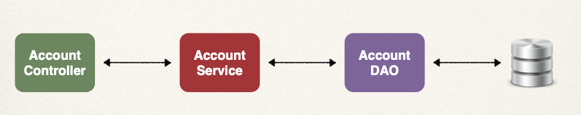

Si sobre esta arquitectura queremos añadir logging a nuestros métodos DAO, antes de comenzar el método, y nos dicen que probablemente haya que añadirlo en más sítios...

```
We don't cover logging in detail. In simple terms you can use this.

import java.util.logging.Logger;

@Aspect
@Component
public class DemoLoggingAspect {

    // setup logger
    private Logger myLogger = Logger.getLogger(getClass().getName());

    // add @Before advice
    @Before("forAppFlow()")
    public void before(JoinPoint theJoinPoint) {

        // display method we are calling
        String theMethod = theJoinPoint.getSignature().toShortString();
        myLogger.info("=====>> in @Before: calling method: " + theMethod);

        ...
   }
}

If you need more details on logging, here is a youtube tutorial

https://www.youtube.com/watch?v=UfdmMlMIKkg
```

Y si ahora necesitamos añadir código de seguridad a nuestro DAO, antes de ejecutarse...

Y si luego nos dicen que nos llevemos ese mismo logging y la seguridad a nuestro Service y al Controller...

Y luego que llevemos eso a todo el sistema...

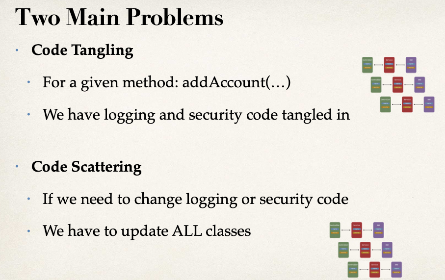

## Otras posibles soluciones

- Herencia: Es posible que funcione, dependiendo de nuestro sistema, pero igualmente tendremos que extender de la clase base y tocar todo el código. Y si alguna de nuestras clases ya extiende de alguna, Java no soporta herencia múltiple. Esta solución NO va a funcionar

- Delegation: Las clases podrían delegar las llamadas a un gestor de logging y gestor de seguridad. Pero necesitamos igualmente actualizar nuestro código si queremos añadir ese soporte, o nuevas características como gestión de APIs... Esta solución tampoco funciona

- Aspect-Oriented Programming (AOP): Un aspecto encapsula lógica transversal. Es un código de infraestructura básico que necesitarán todas las areas de nuestra applicación. Lo que hacemos es tomar ese código de logging / seguridad, lo encapsulamos en un módulo o clase reutilizable y se puede aplicar en múltiples partes de nuestro proyecto de acuerdo a una configuración. Esta solución es buena

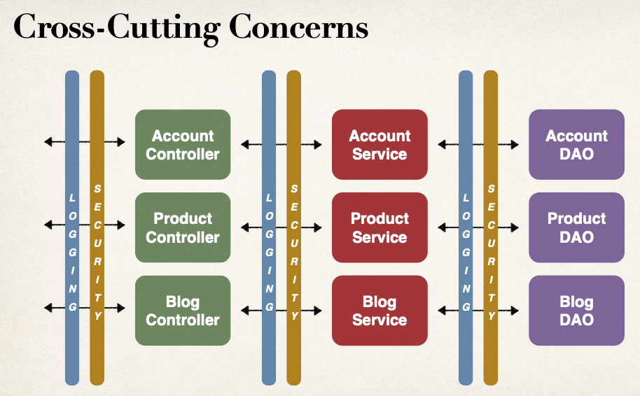

## Solución AOP

En una solución AOP, por debajo se aplica el patrón de diseño Proxy.

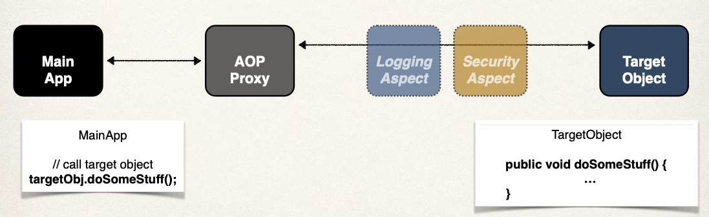

La app main no tiene ni idea sobre AOP, ni proxies. Solo tiene un método call. Es parecido a cuando hacemos una llamada por teléfono a un amigo. Por debajo, nuestra llamada está siendo monitoreada y nosotros no lo sabemos.

Beneficios de AOP:

- El código del aspecto está definido en una sola clase
  - Mucho mejor a que esté esparcido por todos lados
  - Promueve reutilización de código y es fácil de modificar
- El código de negocio en la app es más claro
  - Solo escribimos código específico de nuestro negocio
  - Reduce complejidad del código
- Configurable
  - Basado en configuración, aplicamos Aspectos selectivamente en diferentes partes de nuestra app
  - No es necesario hacer cambios al código principal de la app. Esto es muy importante!

Caso de uso de la AOP

- Más comunes:
  - logging, seguridad, transacciones
- Auditar logging
  - quién, qué, cuando, donde
- Manejo de excepciones
  - log de excepciones y notificación al equipo de DevOps via SMS/email
- Gestión API
  - ¿Cuántas veces se ha llamado a un método usuario?
  - Analytics: ¿horas punta?, ¿carga promedio? ¿mejor usuario?

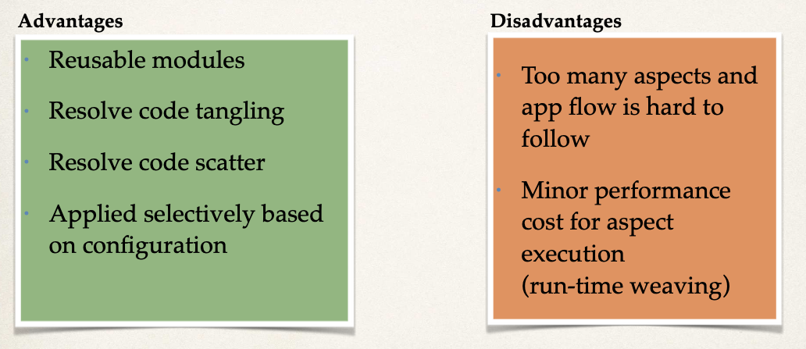

La unica advertencia sería no tener muchos Aspectos y que las operaciones no sean muy pesadas. Usarlo pero con moderación.

## Terminología AOP

- Aspect: Un código en un módulo para problemas transversales (logging, security...)
- Advice: Qué acción se toma y cuando debe aplicarse
- Join Point: Cuándo aplicar código durante la ejecución del programa
- Pointcut: Una expresión predicada para indicar dónde se deben aplicar los Advice

Tipos de Advice:

- Before advice: se ejecutan antes del método
- After finally advice: se ejecuta después del método (como en un finally, en un bloque try...catch)
- After returning advice: se ejecuta después del método (ejecución exitosa)
- After throwing advice: se ejecuta después del método (si se lanza una excepción)
- Around advice: se ejecuta antes y después del método

Weaving

- Conexión de aspectos a objetos de destino para crear un objeto advice
- Tipos diferentes de weaving:
  - Tiempo de compilación, tiempo de carga o tiempo de ejecución
- Con respecto al rendimiento: el weaving en tiempo de ejecución es el más lento

## Buenas prácticas: Aspects y Advices

- Que el código sean pocas líneas
- Que sea rápido
- No realizar operaciones pesadas o lentas
- Entrar y salir LO MÁS RÁPIDO POSIBLE

## Frameworks AOP

- Los dos Frameworks AOP líderes en Java son
  - Spring AOP
  - AspectJ

Spring AOP

- Spring provee soporte AOP de forma automática
- Ya lo usa por debajo en componentes clave
  - Seguridad, transacciones, caching...
- Usa weaving en tiempo de ejecución de aspectos, es decir, usa el patrón proxy para hacer el advice del objeto

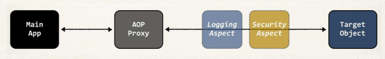

AspectJ

- Es el Framework AOP original, lanzado en 2001
- Provee soporte completo para AOP
- Soporte completo para:
  - join points: a nivel de método, constructor y campo
  - code weaving: en tiempo de compilación, post tiempo de compilación y tiempo de carga

Comparaciones

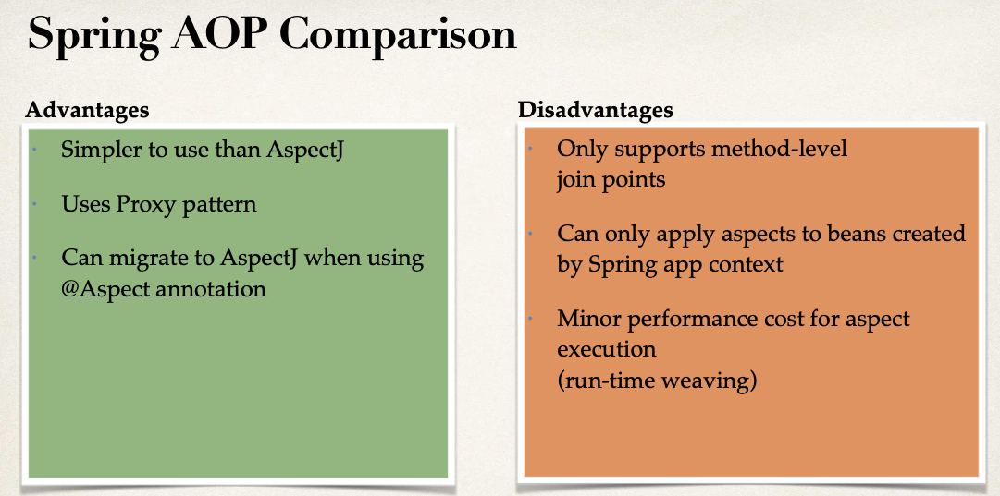

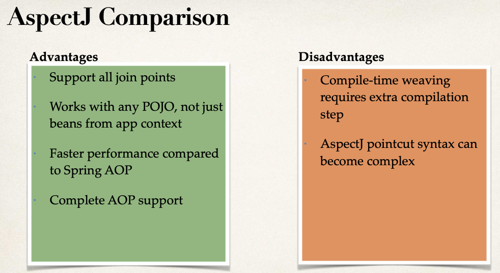

- Spring AOP es una implementación ligera de AOP, pero soluciona los problemas comunes en aplicaciones empresariales

Recomendación

- Comenzar con Spring AOP, porque es más fácil para comenzar
- Si tenemos requerimientos complejos, movernos a AspectJ
  - https://www.geekyhacker.com/how-to-configure-aspectj-in-spring-boot/

## 01-spring-boot-aop-demo

#### Ejemplo AOP con @Before Advice

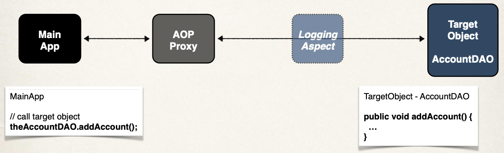

#### @Before Advice

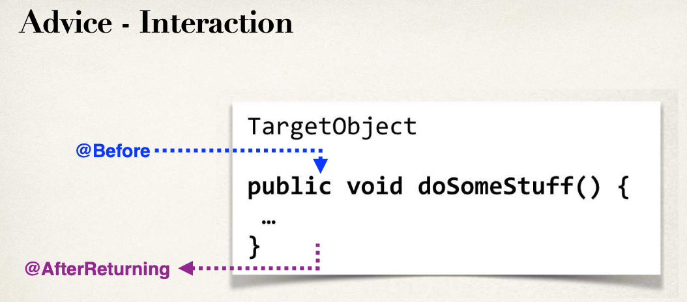

#### Casos de uso

- Más comunes
  - logging, security, transactions (Spring ya hace esto por detrás, usando AOP con la anotación @Transactional)

#### Spring Boot AOP Starter

- Hay que añadir la dependencia spring-boot-starter-aop
  - Spring Boot habilita automáticamente el soporte para AOP
  - No es necesario usar de forma explícita @EnableAspectJAutoProxy, como antiguamente para Spring, ya lo tenemos por defecto para Spring Boot

#### Proceso de desarrollo

- Crear objeto objetivo: AccountDAO
  - Con la anotación @Component
- Crear main app
  - Será un programa de línea de comandos
- Crear Aspect con @Before advice
  - Anotaremos la clase con la anotación @Aspect y con la anotación @Component
  - Creamos un método y lo anotamos con @Before indicando el método de nuestro DAO (la expresión Pointcut)
    - @Before("execution(public void addAccount())")

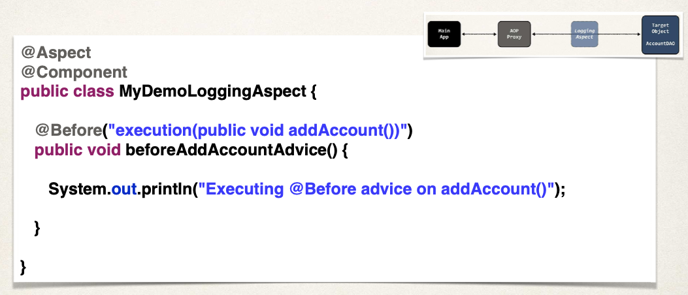

#### Testeo

Para probar el aspecto, ejecutar la app.

Vemos que, por debajo, antes de ejecutarse addAccount() se ejecuta el aspecto beforeAddAccountAdvice()

#### AOP - Pointcut Expressions

Un Pointcut es una expresión predicada para indicar dónde se deben aplicar los Advice.

Hay varios tipos de pointcut.

- Spring AOP usa el lenguaje de pointcut expression de AspectJ
- Comenzaremos con pointcut `execution`
  - Se aplica a ejecución de métodos

**Coincidencia en el nombre del método o patrón**

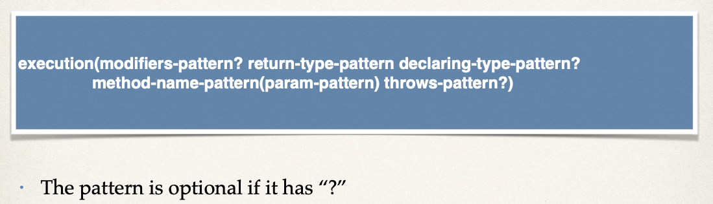

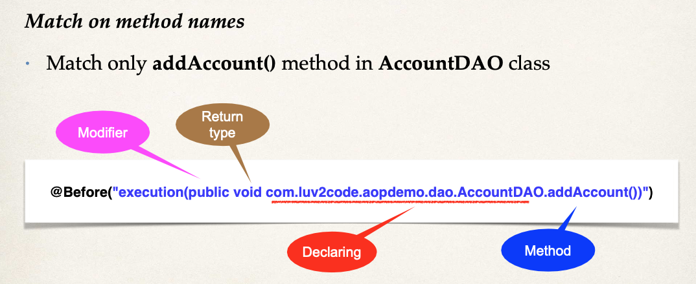

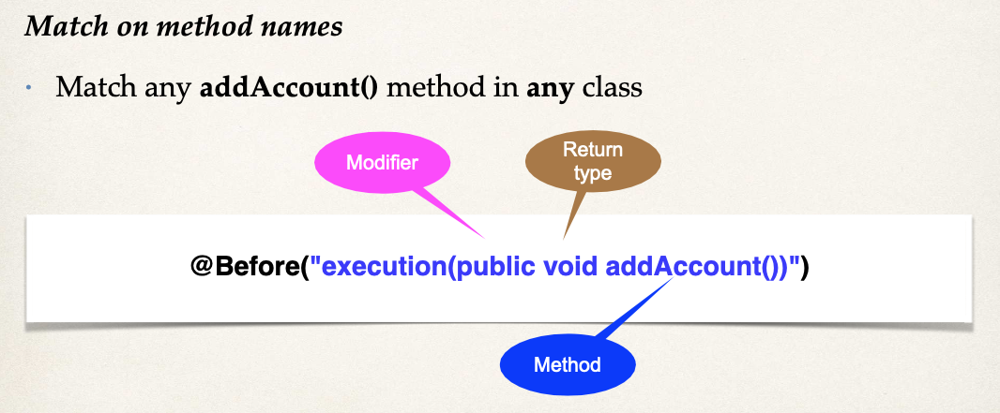

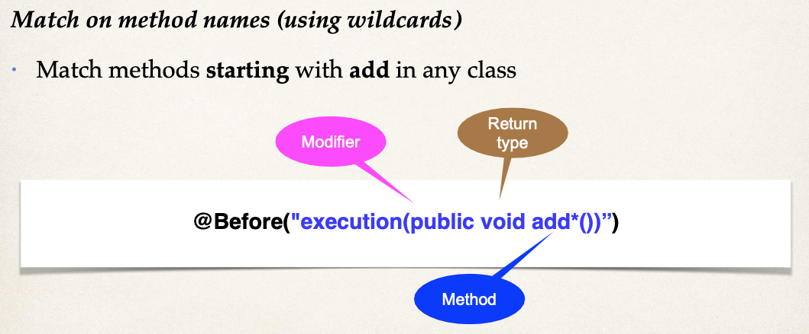

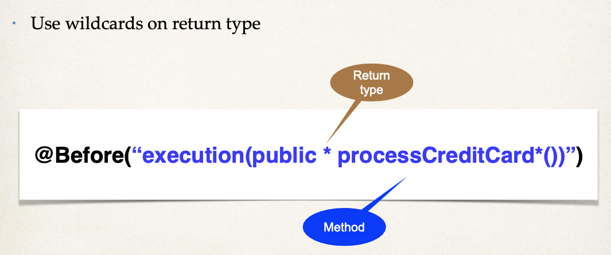

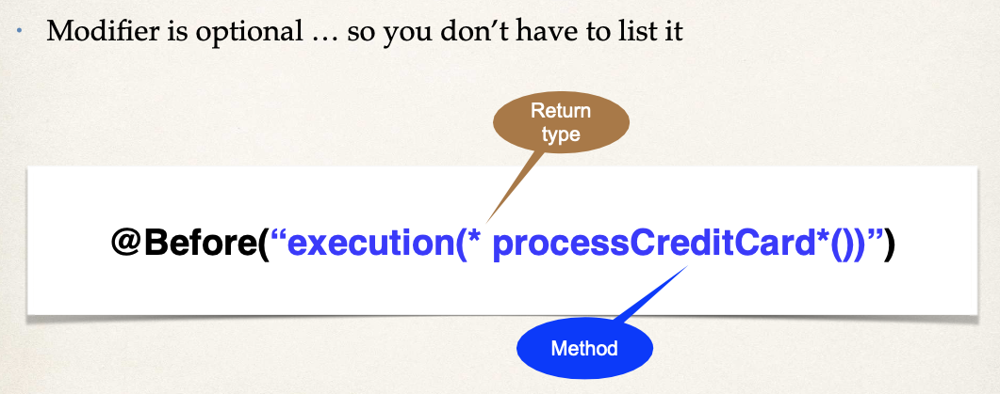

**Coincidencia en los parámetros de los métodos**

Wildcards:

- () --> busca coincidencias con métodos que no tienen argumentos
- (\*) --> busca coincidencias con métodos que tienen un argumento de cualquier tipo
- (..) --> busca coincidencias con métodos que tienen 0 o más argumentos de cualquier tipo

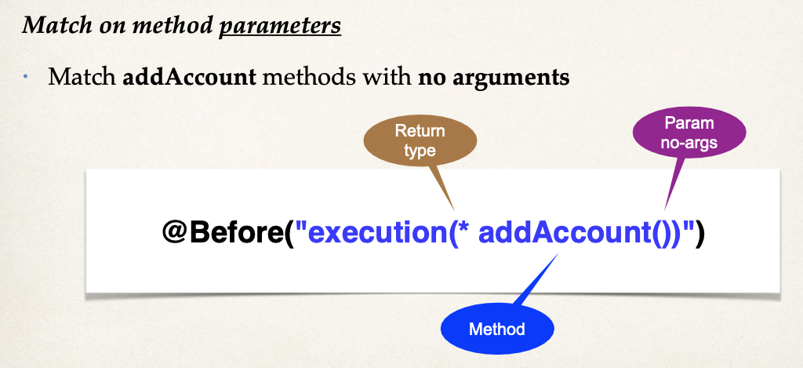

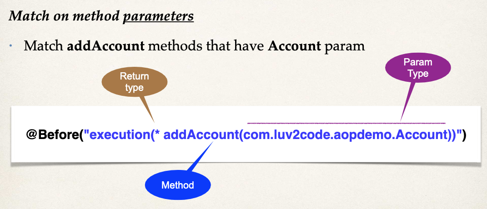

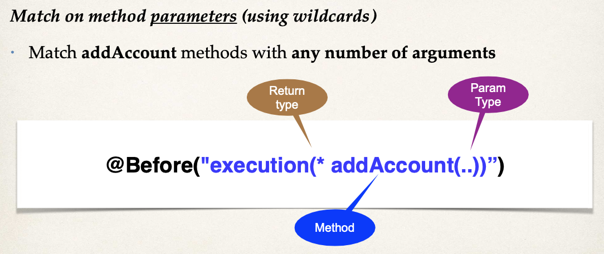

**Coincidencia en el paquete**

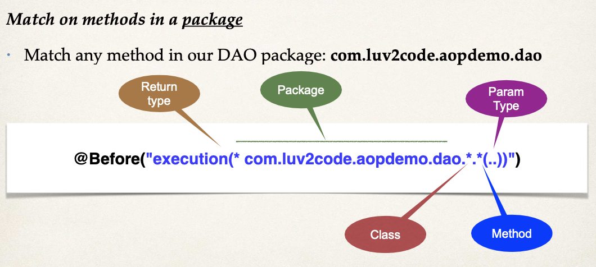

## 02-spring-boot-aop-demo-pointcut-declarations

#### Declaraciones de Pointcut

Ahora mismo tenemos un problema. ¿Cómo podemos reutilizar una expresión Pointcut?

Soluciones:

- Copiar/pegar del método. No es la solución ideal
- La solución ideal es crear una declaración de pointcut y aplicarla a muchos advices
  - Usamos la anotación @Pointcut e indicamos la expresión
  - El método no tiene ni parámetros ni cuerpo, solo sirve para refeerenciar este pointcut
  - 
  - Ahora aplicamos este pointcut a nuestros advices, usando el nombre del método. Puede reutilizarse
  - 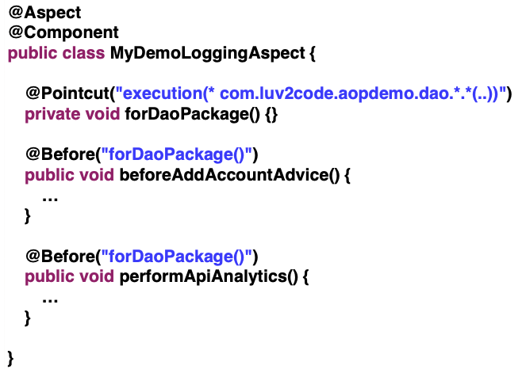

Beneficios de usar declaraciones de Pointcut

- Facilmente reutilizables en expresiones pointcut
- Solo hay que actualizar el pointcut en un sitio
- Se pueden compartir y combinar expresiones pointcut

#### Proceso de desarrollo

- Crear una declaración de pointcut
- Aplicar la declaración de pointcut a los advices

#### Testeo

Para probar el aspecto, ejecutar la app.

#### Combinar Pointcuts

Tenemos un problema. ¿Cómo podemos aplicar varias expresiones pointcut a un advice?

Sería bueno ejecutar un advice solo si se reunen ciertas condiciones.

Queremos realizar el siguiente ejemplo: Aplicar la declaración de pointcut a todos los métodos de un paquete salvo a los métodos getter/setter

Combinando expresiones pointcut:

- Se pueden usar operadores lógicos para incluir/excluir métodos de la expresión pointcut
  - && -> AND
  - || -> OR
  - ! -> NOT
- Funciona como una sentencia "if"
- La ejecución ocurre solo cuando se evalúa a true

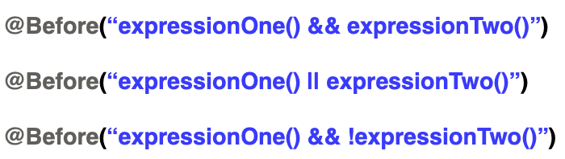

#### Proceso de desarrollo

- Crear declaraciones de pointcut
- Combinar declaraciones de pointcut
- Aplicar la declaración de pointcut a advice(s)

#### Testeo

Para probar el aspecto, ejecutar la app.

## 03-spring-boot-aop-demo-ordering-aspects

#### Ordenando Aspects

Tenemos un problema. ¿Cómo controlamos el orden en el que se aplican los advices?

Vamos a tener tres advices:

- beforeAddAccountAdvice
- performApiAnalyticsAdvice
- logToCloudAdvice

¿Cómo gestionamos el orden de ejecución de los advices? Ahora mismo el orden es indefinido.

Proceso de desarrollo para controlar el orden:

- Refactor: Situar los advices en Aspects separados
  - Igual para los Pointcuts. Nos los llevamos a una clase separada para poderlos compartir
- Controlar el orden en los Aspects usando la anotación de clase @Order
  - Ejemplo: @Order(1)
  - Los números más bajos tiene una precedencia más alta
    - Rango: Integer.MIN_VALUE a Integer.MAX_VALUE
    - Los números negativos están permitidos
    - Los números no tienen por qué ser consecutivos
    - Si dos aspectos tienen el mismo número de @Order, su orden es indeterminado, pero no afecta al orden general de todos los aspectos
- Esto garantiza el orden en el que se aplicarán los Aspects

#### Testeo

Para probar el aspecto, ejecutar la app.

Veremos que el orden es:

- 1. MyCloudLogAspect
- 2. MyLoggingDemoAspect
- 3. MyApiAnalyticsAspect

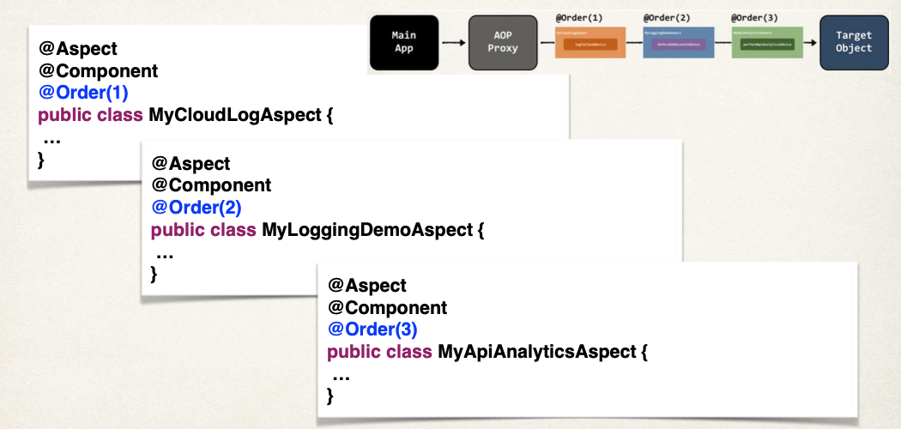

#### Leer argumentos de los métodos con JoinPoints

Tenemos un problema. Cuando estamos en el aspecto, ¿Cómo podemos acceder a los parámetros de los métodos?

Proceso de desarrollo:

- Acceder y mostrar la firma del método
  - Usamos como argumento del método anotado con @Before un tipo JoinPoint
  - JoinPoint tiene metadata sobre el método que se está ejecutando
  - 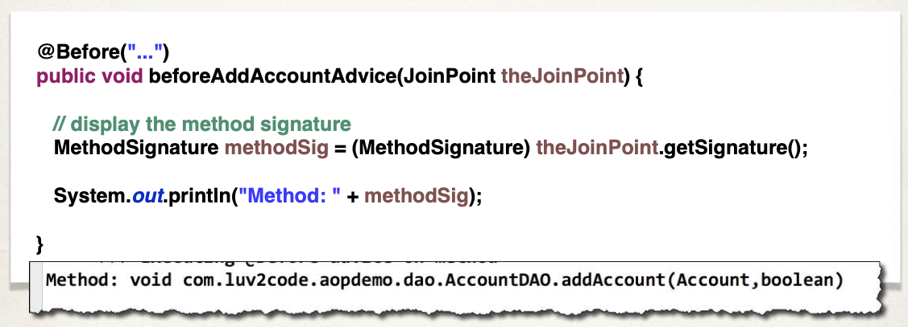
- Acceder y mostrar los argumentos del método
  - También usamos como argumento del método anotado con @Before un tipo JoinPoint
  - 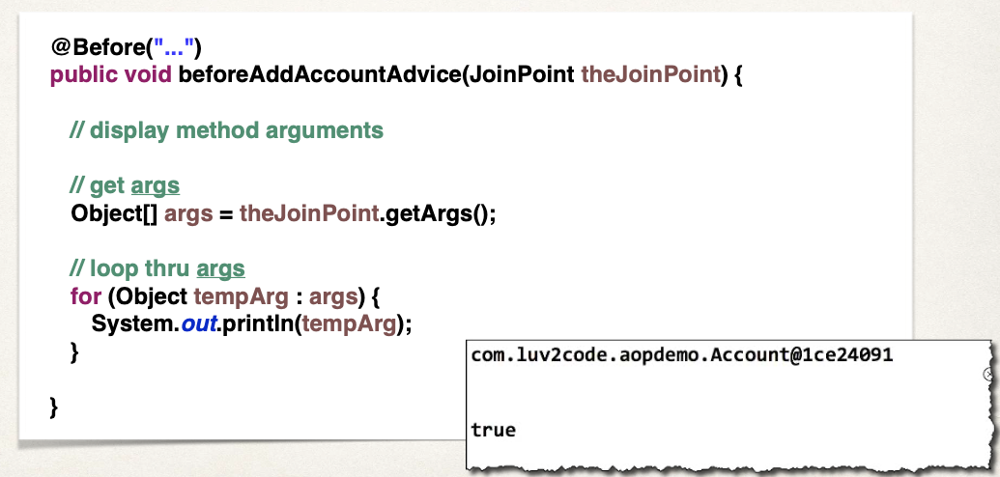

#### Ejemplo AOP con @AfterReturning Advice

Vamos a crear un advice que se ejecutará tras finalizar un método de forma exitosa.

El método sobre el que se aplicará el advice será findAccounts()

El advice @AfterReturning se ejecuta tras ejecutarse el método de forma exitosa (sin excepciones).

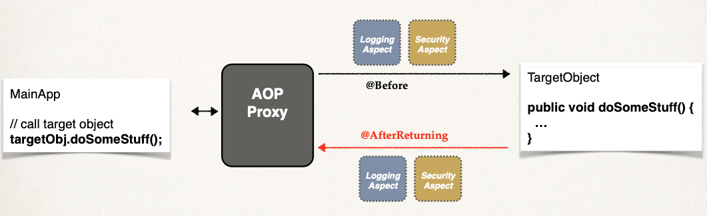

Normalmente necesitamos acceder al valor devuelto por el método llamado. En nuestro ejemplo findAccounts() devuelve una lista de Account y en nuestro advice los vamos a listar.

Para ello:

- Usamos el parámetro returning dentro de la anotación @AfterReturning
  - Le damos un nombre (result)
- Usamos un parámetro del método advice con tipo JoinPoint
- Usamos un tipo de parámetro en el método advice, que será en este caso la lista de Accounts
  - El nombre del parámetro será el indicado en returning (result)
- Ya dentro del método advice, podemos usar la variable (result)

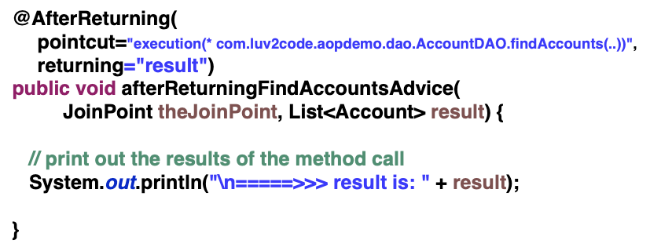

Casos de uso:

- Más comunes
  - logging, security, transactions
- Post-procesamiento de datos
  - Post-procesamiento de datos antes de volver al llamador
  - Formatear o enriquecer la data (con cuidado)

Proceso de desarrollo:

- Trabajo preparatorio: Añadir constructores a la clase Account
- Añadir un nuevo método: findAccounts() en AccountDAO
- Actualizar la app main par que llame al nuevo método: findAccounts()
- Añadir un advice @AfterReturning

Test:

- Ejecutar la app y ver el resultado en consola.

#### @AfterReturning Advice - Modificar valor devuelto

Nos concentramos en el uso de caso en el que realizamos un post-procesamiento de la data antes de devolverla al llamador.

Interceptamos la data y realizamos un trabajo adicional sobre ella, formateándola o enriqueciéndola.

Eso si, tenemos que tener cuidado porque esa data transformada, un programador que no haya hecho ese advice o no conozca AOP, puede que no sepa de donde viene.

El equipo de desarrollo debe ser comunicado de que se está usando AOP y que se está haciendo esta transformación en la data.

Recordar que usar AOP es como que hay un espía. Es como si se hace un pedido a Amazon y ese espía coge el paquete y le pone o quita cosas.

El paquete nos llega y no hay lo que habíamos pedido. Nosotros no sabemos que existe ese espía y que ese paquete fue interceptado y modificado.

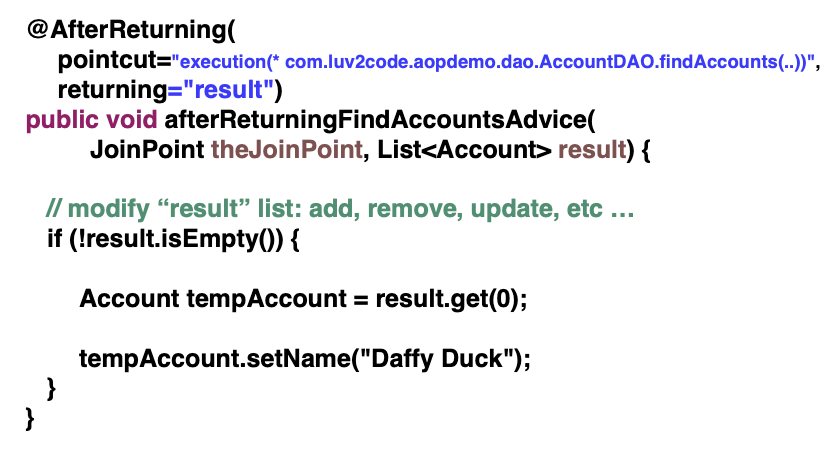

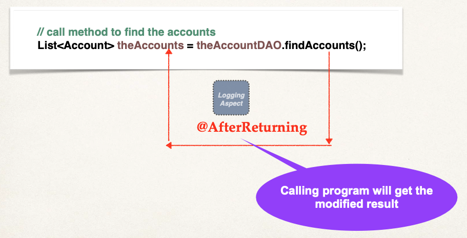

Test:

- Ejecutar la app y ver el resultado en consola.
